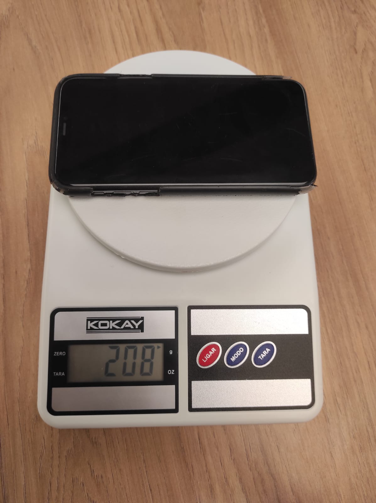

# Documentação IoTDoc - Módulo 4 - Inteli


## Electron

#### Ana Clara Marques, Lucas Barbosa, Mateus Marçal, Nicollas Isaac, Paula Piva e Thiago Goulart.


## Sumário

[1. Introdução](#c1)

[2. Metodologia](#c2)

[3. Desenvolvimento e Resultados](#c3)

[4. Possibilidades de Descarte](#c4)

[5. Conclusões e Recomendações](#c5)

[6. Referências](#c6)

<br>


# <a name="c1"></a>1. Introdução

O Instituto de Pesquisas Tecnológicas, IPT, é uma empresa de médio porte localizada dentro da Cidade Universitária, na cidade de São Paulo. Nesse sentido, o instituto realiza contribuições para o desenvolvimento econômico, sustentável e para a melhoria da qualidade de vida geral, o que gera conhecimento tanto na área científica, quanto na área de tecnologia e inovação. O IPT atua em uma série de setores, tendo um laboratório ou um centro tecnológico dedicado a cada um deles: Metrologia, Química e Manufaturados, Tecnologia e Informação, Obras e Infraestrutura, Recursos Florestais, Metalurgia e Materiais, Mecânica Naval e Elétrica, Tecnologia Geoambientais, Ambiente Construído, Bionanomanufatura, Estruturas Leves[1]. 

No atual projeto em desenvolvimento, o foco será voltado ao segmento de infraestrutura, especificamente à Seção de Obras Civis (SOC). Nesse sentido, essa seção “oferece consultorias e auditorias, ensaios laboratoriais e *in loco*, estudos tecnológicos convencionais e inovadores, participando de todas as fases da vida útil de obras e empreendimentos, desde a concepção até a construção e desenvolvimento, contribuindo para a sua preservação, com foco principal em Estruturas e Geotecnia/Geologia” [2].

O IPT possui um posicionamento de mercado com base na diferenciação competitiva, que consiste em captar,  analisar  e transformar dados em gráficos e tabelas sem ter que recorrer a terceirizados, isso lhes confere grande vantagem competitiva, uma vez que eles são os únicos no território nacional capazes de realizarem tais feitos de uma só vez. Além disso, o instituto atua em território internacional, com presença em uma área dedicada exclusivamente à gestão das atividades internacionais. 

Por fim, o Instituto de Pesquisas Tecnológicas (IPT) é uma instituição de médio porte com um notável histórico de contribuições para o desenvolvimento econômico e a melhoria da qualidade de vida. Ao atuar em diversos setores, principalmente na área de infraestrutura, o IPT desempenha um papel crucial no monitoramento de obras civis, fornecendo serviços de alta qualidade em consultoria, auditoria, ensaios e estudos tecnológicos. Portanto, é notório que o IPT está focado em impulsionar avanços na área de pesquisa e tecnologia.

## 1.1 Objetivos

O objetivo principal deste projeto é reduzir o custo dos equipamentos utilizados no monitoramento de obras civis e facilitar a instalação utilizando comunicação sem fio entre os dispositivos. Desse modo, os propósitos deste trabalho podem ser separados em duas modalidades: objetivos gerais e específicos.

### 1.1.1 Objetivos Gerais

* Redução de Custos: O foco central é a redução substancial dos gastos relacionados ao monitoramento de obras civis, o que torna essa prática mais acessível e eficaz e viabiliza a implementação de soluções de alta qualidade a um custo mais baixo.

* Simplificação da Operação: Procura-se simplificar o processo de instalação e operação dos equipamentos, eliminando a necessidade de cabos extensos, o que torna o sistema de fácil utilização e manutenção.

* Coleta e Armazenamento Eficientes: O objetivo é alcançar uma coleta eficiente de dados das Células de Carga, proporcionando armazenamento interno e um acesso simplificado para análise, o que garante a eficiência e disponibilidade dos dados.

### 1.1.2 Objetivos Específicos

* Desenvolver um protótipo funcional capaz de realizar medições precisas usando Células de Carga com uma precisão de 10^-5 casas decimais, erro de linearidade não superior a 0,01% e repetibilidade dos resultados.

* Facilitar o ajuste do zero (tara) das medições no início de cada ensaio, possibilitando a calibração e configuração do sistema.

* Possibilitar a leitura contínua dos dados a frequências desejadas, permitindo uma análise detalhada e em tempo real das variações de força ao longo do tempo.

* Implementar notificações por e-mail para eventos específicos, como valores mínimos e máximos, garantindo uma resposta imediata a situações críticas.

* Fornecer orientações claras sobre o armazenamento de dados e sobre as opções de fornecimento de energia, incluindo bateria recarregável com energia solar.

* Desenvolver um aplicativo para a visualização de gráficos em tempo real, garantindo uma análise eficaz e um acesso conveniente aos dados.

## 1.2 Proposta da solução

A proposta de solução apresentada neste projeto aborda as questões anteriormente mencionadas com um foco claro na eficiência e acessibilidade. O protótipo desenvolvido (condicionador de sinal, projetado para a captação dos sinais provenientes das células de carga de 10Kg que serão usadas na solução IoT) compreende os seguintes componentes essenciais:

* Dispositivo Arduino/ESP32 de Baixo Custo: A base da solução consiste na utilização de um dispositivo Arduino/ESP32, uma plataforma de baixo custo que não compromete a qualidade das medições. Essa escolha garante que a solução seja acessível sem sacrificar a precisão dos resultados.

* Display Integrado para visualização com uma frequência contínua: A inclusão de um display integrado permite a visualização frequente dos dados coletados, o que torna o sistema de monitoramento mais eficaz e prontamente compreensível para os operadores.

* Sensor de Célula de Carga de Alta Precisão: O protótipo é projetado para interagir com Células de Carga, o que garante que as medições sejam realizadas com alta precisão. Esse componente fundamental é essencial para a obtenção de resultados confiáveis.

* Coleta e Armazenamento Eficiente de Dados: A solução é equipada para coletar dados de Células de Carga de maneira eficiente, armazenando-os internamente para fácil acesso e análise. Além disso, a capacidade de transmitir dados diretamente para um computador ou uma plataforma de armazenamento em nuvem possibilita o acesso remoto e a supervisão contínua.

* Ampla Gama de Funcionalidades Adicionais: Além dos componentes principais, a proposta de solução busca oferecer um conjunto abrangente de funcionalidades adicionais, incluindo:

	* Mínimo Tamanho Físico: O protótipo é projetado para ocupar o menor espaço possível, garantindo flexibilidade na sua implantação em diferentes cenários.
	* Ajuste de Zero (Tara) Fácil: Um botão físico é incorporado para ajustar o zero das medições no início de cada ensaio, simplificando o processo de calibração.
	* Leituras Contínuas em Diferentes Frequências: Os dados podem ser coletados em diversas frequências, o que permite uma análise detalhada das variações de força ao longo do tempo.
	* Notificações por E-mail e Alertas Visuais: A solução inclui notificações por e-mail para eventos críticos e pode gerar alertas visuais em situações específicas.
	* Armazenamento em Diferentes Formatos: Oferece orientações sobre o armazenamento de dados em diferentes formatos, como .csv, .txt ou .xls, proporcionando flexibilidade no uso dos dados.

Portanto, esta proposta de solução combina uma abordagem econômica com um conjunto diversificado de recursos para atender às necessidades do monitoramento de obras civis de forma eficaz, acessível e versátil.

## 1.3 Justificativa

A justificativa para a realização deste projeto encontra-se no fato de que o IPT busca uma solução de baixo custo, com mais acessibilidade e boa precisão. Dessa forma, além dos benefícios já elencados, esta justificativa é substanciada por vários aspectos-chave:

* Diminuição de Gastos Financeiros do IPT: A redução dos custos associados ao monitoramento de obras civis é uma faceta crucial da motivação para este projeto. Com a implementação da solução proposta, o IPT poderá economizar consideravelmente. Ao evitar os custos elevados associados aos equipamentos convencionais, a instituição terá mais recursos disponíveis para direcionar a outras iniciativas de pesquisa e desenvolvimento. Esta economia de gastos diretos não apenas beneficia o IPT, mas também o torna mais ágil e eficiente na alocação de recursos.

* Eficiência Operacional: O IPT busca otimizar a eficiência operacional ao simplificar a instalação e operação dos equipamentos, eliminando a necessidade de lidar com cabos extensos e complexos. Isso se traduz em economia de tempo e recursos, tornando o processo de monitoramento mais ágil e eficaz. Além disso, a facilidade de operação promovida por essa inovação tem o potencial de beneficiar os objetivos de cada projeto de infraestrutura que o IPT assume.

* Acesso e Análise de Dados com uma frequência contínua: O acesso fácil e análise dos dados coletados com uma frequência contínua é de extrema importância para o setor de infraestrutura. A solução proposta, ao permitir o acesso aos dados e sua análise em tempo real, fornece informações valiosas que podem direcionar a tomada de decisões informadas. Isso resulta em maior segurança e eficácia na gestão de obras civis, contribuindo para o cumprimento dos objetivos e prazos de projetos com sucesso.

Portanto, essas justificativas demonstram que o atual projeto em desenvolvimento trará muitos benefícios para o IPT, uma vez que, principalmente, diminuirá os custos com um condicionador de sinal. Assim, este projeto se diferencia no fato de que trará dados com alta precisão, o que evita possíveis desastres futuros.

# <a name="c2"></a>2. Metodologia 

A metodologia adotada no desenvolvimento do atual projeto foi a Reference Model for Open Distributed Processing (RM-ODP). Nesse sentido, conforme o artigo "The Reference Model of Open Distributed Processing: Foundations, Experience, and Applications" dos autores Haim Kilov, Peter F. Linington, José Raul Romero, Akira Tanaka, e Antonio Vallecillo [10], ela tem como objetivo descrever a arquitetura de infraestruturas de processamento aberto e distribuído (ODP) - o que facilita para um olhar do projeto como um todo, desde a área empresarial até a área tecnológica. Assim, a RM-ODP é composta por cinco pontos de vista, sendo que cada um desempenha um papel crucial na estruturação da combinação de requisitos organizacionais. A figura 01 indica a estrutura da Metodologia RM-ODP e seus respectivos pontos de vista:

<div align="center">
<p align="center"><strong>Figura 1 - Metodologia RM-ODP</strong></p>


<p align="center">Fonte: RM-ODP - https://en.wikipedia.org/wiki/RM-ODP (2023).</p>
</div>


### Ponto de Vista da Empresa (Enterprise Viewpoint)

O Ponto de Vista da Empresa diz respeito à perspectiva do negócio, o que permite focar nos processos, propósito, escopo e políticas do sistema ao descrever comunidades inter-relacionadas. Dessa forma, ele lida com a natureza e os objetivos da organização, além das regras impostas pelo ambiente operacional do sistema, o que visa capturar as necessidades de negócio da empresa. [11]

No contexto do atual projeto em desenvolvimento, o grupo Eléctron fez o entendimento do negócio logo na sprint 1, quando buscou conhecer mais sobre os processos, objetivos, contexto e escopo do IPT. Dessa forma, a equipe registrou essa análise principalmente na seção “3.1. Domínio de Fundamentos de Negócio” deste documento - o que ajudou a equipe a fazer um entendimento do negócio tanto por parte do cliente quando por parte do produto que está sendo desenvolvido. Nesse sentido, essa análise possibilitou um entendimento melhor de qual é o contexto da indústria do cliente e sua análise SWOT, o que ajudou entender para quem o grupo Eléctron está desenvolvendo o protótipo. Além disso, essa análise ajudou o grupo a entender mais a solução em si, realizando a descrição, matriz de riscos, politica de privacidade e lista de materiais do condicionador de sinal que a equipe está desenvolvendo.

### Ponto de Vista de Informação (Information Viewpoint)

O Ponto de Vista de Informação possui relação com a perspectiva da semântica da informação, identificando os objetos informacionais. Nesse sentido, ele define os tipos de dados a serem trocados entre os sistemas, a fim de alcançar um nível básico de consistência na interpretação e uso dessas informações. Ou seja, está relacionado com a informação armazenada e processada pelo sistema a ser desenvolvido.

No atual cenário do condicionador de sinais, essa etapa se concentrou em definir as informações que seriam manipuladas pelo sistema. Dessa forma, a equipe Eléctron se dedicou a relacionar os dados que são coletados pelo ESP-32 (como temperatura, força peso e deslocamento) com a plataforma Ubidots - o que proporcionou uma visualização melhor dos dados para os colaboradores do IPT - por meio de conexões Via Wi-Fi e utilizando o Protocolo MQTT. Assim, esse ponto de vista foi desenvolvido logo nas primeiras sprints quando o grupo identificou quais seriam os compotentes no contexto informacional, o que foi fundamental para a equipe entender como funciona o fluxo de informações no projeto.

### Ponto de Vista de Computação (Computational Viewpoint)

Este ponto de vista está relacionado com as funcionalidades do sistema, descrevendo a arquitetura de software do sistema de forma independente, o que foca apenas na funcionalidade básica, como distribuição ou replicação, a fim de garantir consistência no sistema. Em outras palavras, ele expressa o design funcional do sistema.

No atual projeto em desenvolvimento, é importante analisar quais as funcionalidades que o condicionador de sinais tem. Nesse sentido, são notórios como funcionalidades básicas o botão de tara, o sensor de temperatura, a célula de carga, o LED (com diversas cores como funcionalidades), o display, o módulo HX711 e o Leitor de Cartão SD. Dessa forma, essas funcionalidades foram perfeitamente ilustradas na seção “3.2.4. Protótipo de interface com o usuário” dessa documentação, quando a equipe Electron fez o desenho esquemático que representa qual a funcionalidade de cada componente citado. Assim, este ponto de vista foi essencial para a equipe elencar as principais funcionalidades do projeto, o que ajuda a entregar um protótipo com qualidade e de acordo com o que o cliente expôs no TAPI.

### Ponto de Vista de Engenharia (Engineering Viewpoint)

O ponto de vista de engenharia diz respeito à distribuição do sistema, fornecendo um conjunto de conceitos e soluções genéricas de middleware e modelos para transformar a especificação computacional em uma implementação concreta. Desse modo, ele considera aspectos como a localização de componentes, comunicação entre diferentes partes do sistema e gerenciamento de recursos.

No contexto do projeto que está sendo desenvolvido para o IPT, essa etapa se concentrou principalmente quando a equipe Eléctron desenvolveu os Requisitos Funcionais e Requisitos Não Funcionais, documentados respectivamente nas seções “3.3.1. Requisitos Funcionais” e “3.3.2. Requisitos Não Funcionais”. Dessa forma, como o Ponto de Vista de Engenharia considera também a distribuição do sistema, é importante acrescentar que o grupo também documentou a arquitetura da solução na seção “3.3.4. Arquitetura da Solução”. Assim, esse ponto de vista foi muito importante para o projeto, pois possibilitou uma visão de como o sistema está distribuído.

### Ponto de Vista de Tecnologia (Technical Viewpoint)

Por fim, o ponto de vista de tecnologia se refere a produtos e tecnologia, o que expressa as políticas para a seleção de componentes e tecnologias adequadas, além dos recursos disponíveis para apoiar a implementação e manutenção do sistema. Nesse sentido, esse ponto de vista aborda as escolhas e considerações tecnológicas relacionadas à implementação de um sistema distribuído. 

No atual cenário do condicionador de sinais, a equipe “Electron” até o atual momento, as principais tecnologias utilizadas são: o ESP-32 para realizar o condicionamento de sinais, a plataforma Ubidots para apresentar graficamente os dados obtidos em tempo real; e o protocolo MQTT para fazer a conexão e envio dos dados com a plataforma Ubidots. Nesse viés, este ponto de vista foi documentado na seção "3.3.5. Arquitetura do Protótipo" deste documento, a qual explica detalhadamente as tecnologias utilizadas no projeto e a relação entre elas - o que ajudou o grupo a ter um entendimento maior de como as tecnologias se relacionam entre si e com o que o IPT explicitou no TAPI.

### Conclusão

Portanto, a aplicação da metodologia RM-ODP no desenvolvimento do projeto do condicionador de sinaL para o IPT tem se demonstrado essencial para uma abordagem estruturada e abrangente. Nesse sentido, ao abordar os cinco pontos de vista da RM-ODP e a relação entre estes, tal metodologia possibilitou a compreensão dos objetivos empresariais até a melhoria tecnológica. Por fim, a análise minuciosa desses pontos de vista é importante para embasar as decisões e um bom entendimento da equipe Eléctron, ao ter um olhar holístico do atual projeto em desenvolvimento.

# <a name="c3"></a>3. Desenvolvimento e Resultados 

## 3.1. Domínio de Fundamentos de Negócio

### 3.1.1. Contexto da Indústria

O IPT (Instituto de Pesquisas Tecnológicas) é uma instituição pública dedicada à pesquisa e desenvolvimento, e, quanto ao seu modelo de negócio, atua principalmente como uma entidade B2B (Business to Business), o que significa que presta serviços a outras organizações, incluindo empresas privadas e, sobretudo, instituições governamentais. A instituição possui uma estrutura organizacional enxuta, composta por um presidente, diretorias técnicas e unidades técnicas, cada uma com seu próprio diretor. Além disso, cada seção das unidades técnicas também conta com um diretor técnico.

Atualmente, o IPT opera em um cenário em que os pesquisadores desempenham o papel de vendedores e gerentes de projetos, assumindo a maior parte das etapas, enquanto o IPT se encarrega dos aspectos financeiros. Embora isso proporcione uma certa autonomia, pode dificultar a aquisição de clientes. A nova gerência, por outro lado, está ajustando sua abordagem para se concentrar mais na prospecção de clientes e desempenhar um papel mais ativo no aspecto comercial.


O mercado de pesquisa e desenvolvimento no qual o IPT atua é caracterizado pela colaboração interdisciplinar em busca de soluções inovadoras aplicáveis em diversos projetos e organizações. É portanto um mercado que abrange um amplo espectro e serve como pilar fundamental para o avanço tecnológico, demonstrando tendência para  despertar o interesse de empresas e organizações em todo o mundo. Essas características tornam esse segmento propenso a um aumento na demanda e nos investimentos, consolidando-se como um mercado próspero e em expansão para os próximos anos.

Dentro desse contexto, é importante observar que há várias instituições públicas que atuam na área de pesquisa e desenvolvimento e que podem ser consideradas concorrentes em potencial, embora frequentemente acabem se tornando parceiras em projetos colaborativos. Algumas dessas instituições incluem o Instituto Nacional de Tecnologia (INT), o Instituto Nacional de Tecnologia da Informação (ITI) e o Instituto Nacional de Pesquisa em Energia e Materiais (CNPEM). Apesar do destaque dessas instituições em fornecer pesquisas de alta qualidade, o mercado brasileiro oferece uma ampla variedade de instituições competentes, deixando espaço para prosperidade e crescimento.

A seguir, é possível analisar de forma aprofundada o IPT e o mercado em que está inserido por meio da análise de 5 forças de Porter.  Esse framework, pensado por Michael Porter em 1979,  é usado para entender melhor o mercado em que a empresa está inserida. Através desse método, é possível obter uma visão mais profunda sobre os principais concorrentes, bem como as tendências e possíveis ameaças que a instituição pode enfrentar no ambiente ao seu redor. Isso ajuda a identificar os aspectos críticos em que a instituição deve se concentrar para se manter atualizada e competitiva. 

As 5 forças de Porter e suas definições incluem:

- **Rivalidade entre concorrentes:** analisa quem são os possíveis concorrentes da instituição, ou seja, aqueles que atuam no mesmo setor e competem pelos mesmos clientes. É também a força responsável por avaliar as possíveis vantagens que esses concorrentes têm sobre a instituição, o que pode representar uma ameaça

- **Poder de barganha dos fornecedores:** aprofunda sobre quais são as formas dos fornecedores da instituição estudada alterarem os preços aplicados aos seus materiais e serviços e quanto isso pode impactar a instituição. A tendência é de que os fornecedores vendam a maior quantidade possível e por preços vantajosos a eles.

- **Poder de barganha dos compradores:** abrange o quanto os clientes, a partir da sua influência e concentração, consegue pressionar ou não a compra e os preços dos serviços e produtos oferecidos pela instituição estudada e o quanto isso afeta essa instituição.

- **Ameaça de produtos substitutos:** pesquisa quais são os possíveis produtos ou serviços que podem entrar no lugar daqueles oferecidos pela organização em questão, satisfazendo as mesmas necessidades do cliente e colocando em risco o que é utilizado atualmente.

- **Ameaça de novos entrantes:** analisa quanto o setor está aberto a novos concorrentes e quais são as barreiras que eles deverão enfrentar para se manterem dentro desse mercado, além de avaliar o  que elas podem apresentar que as tornaram uma concorrente ainda mais forte.

Abaixo é possível ver os pontos principais a serem destacados em cada força que atua em relação ao IPT.

<div align="center">
<p align="center"><strong>Figura 2 - Análise das 5 forças de Porter do IPT</strong></p>
	


<p align="center">Fonte: Autoria grupo Electron (2023).</p>
</div>

Considerando cada força e os aspectos relacionados ao IPT citados acima é possível aprofundar da seguinte forma:

**Ameaça de novos entrantes:** A área de pesquisa e desenvolvimento é notoriamente dinâmica, pois impulsiona a inovação e a implementação de soluções em empresas e instituições cotidianas. No Brasil, esta área está em constante ascensão, beneficiando-se de excelentes instituições públicas já estabelecidas e do aumento esperado de investimentos nos próximos três anos [3].
Diante dessa realidade existe a possibilidade de surgimento de novos entrantes que poderiam representar uma ameaça para o IPT se apresentassem vantagens competitivas, como investimentos substanciais e a atração de talentos com ampla experiência na pesquisa e desenvolvimento. Tais vantagens poderiam causar o rompimento das barreiras de entrada, que nesse caso seriam principalmente a confiabilidade dos resultados entregues por pesquisadores e instituições com anos de experiência, como é o caso do IPT.

**Ameaça de produtos e serviços substitutos:** Ao colaborar com o setor de pesquisa e desenvolvimento, o IPT não enfrenta uma ameaça significativa de serviços substitutos no que diz respeito à área de pesquisa e desenvolvimento. Isso se deve ao fato de que este serviço é fundamental e insubstituível. No entanto, a maneira como esse serviço é executado pode estar sujeita a potenciais ameaças. Por exemplo, o investimento em pesquisas conduzidas por empresas privadas e até mesmo por indivíduos, como influenciadores na área de ciência e tecnologia, pode representar uma ameaça, uma vez que eles podem oferecer vantagens que não são contempladas pelo serviço tradicional atual.

Nesse sentido, quando as empresas privadas conduzem suas próprias pesquisas, elas têm a vantagem de custos menores a longo prazo e um maior controle sobre o processo. Por outro lado, iniciativas de indivíduos, como influenciadores, têm a vantagem de apresentar as pesquisas e resultados de uma forma mais compreensível para o público em geral, uma vez que possuem habilidades de comunicação mais desenvolvidas nesse setor, tornando o conhecimento mais acessível.

**Rivalidade entre concorrentes:** No âmbito da pesquisa e desenvolvimento, o IPT encara uma variedade de instituições públicas brasileiras que competem em termos de capacidade e excelência. Três exemplos concretos incluem o Instituto Nacional de Tecnologia (INT), o Instituto Nacional de Tecnologia da Informação (ITI) e o Instituto Nacional de Pesquisa em Energia e Materiais (CNPEM). Essas instituições apresentam vantagens que potencialmente as tornam concorrentes em relação ao IPT, principalmente no que tange a especialização. 
No caso do INT, por exemplo, há maior dedicação à metrologia, materiais e processos industriais, o que lhe confere uma maior profundidade e expertise nessas áreas. Essa especialização pode ser vista como uma possível ameaça para o IPT, uma vez que essas instituições podem apresentar competição direta em suas áreas de foco.

**Poder de barganha dos fornecedores:** Dado o amplo escopo de áreas de pesquisa no IPT, uma variedade de fornecedores atende às diversas necessidades. Concentrando-se na área de construção civil, é importante notar que o mercado de fornecedores de materiais é diversificado, abrangendo empresas de pequeno, médio e grande porte. Isso, em geral, atenua o poder de barganha dos fornecedores. No entanto, é importante destacar que, após a pandemia, muitas empresas de pequeno e médio porte enfrentaram desafios na manutenção de sua estabilidade financeira, o  que poderá potencialmente aumentar o poder de barganha dos fornecedores de grande porte neste momento [4], o que se caracteriza como uma zona de alerta para o IPT.

**Poder de barganha dos clientes:** Os clientes do IPT abrangem um amplo espectro, incluindo empresas privadas, instituições governamentais e organizações sem fins lucrativos. Isso se traduz em uma notável diversidade de clientes, muitos dos quais detêm um significativo poder de influência econômica. Embora o IPT forneça serviços de importância vital para esses clientes, é importante observar que suas posições de influência podem resultar em um aumento no poder de barganha desses clientes, representando um ponto crítico a ser monitorado.

Diante da análise das cinco forças de Porter aplicadas ao IPT, torna-se evidente a complexidade do ambiente em que a instituição está inserida e a necessidade de uma gestão estratégica sólida para enfrentar os desafios e potencializar as oportunidades. É também inegável que existe a necessidade contínua de adaptação e inovação por parte do IPT. Ao manter-se vigilante em relação às mudanças no ambiente externo e fortalecer suas capacidades internas, o Instituto estará mais bem preparado para enfrentar os desafios e capitalizar as oportunidades em sua jornada contínua de excelência em pesquisa e desenvolvimento tecnológico.


### 3.1.2. Análise SWOT	


A matriz SWOT (Strengths, Weaknesses, Opportunities, Threats), [5] trata-se de uma ferramenta de gestão estratégica que permite analisar alguns aspectos de uma empresa, como as suas forças, fraquezas, oportunidades e ameaças. A utilização da matriz SWOT é muito importante para melhorar a tomada de decisões nas empresas e instituições, já que proporciona um entendimento mais aprofundado da posição que a entidade se encontra. Através da análise SWOT, é possível discernir tanto os elementos internos como externos que impactam uma organização. Os fatores internos são os aspectos controláveis pela empresa, na matriz são as forças e fraquezas, enquanto os fatores externos são os elementos sobre os quais a instituição não tem controle, no caso as oportunidades e ameaças. 

Considerando a definição de matriz SWOT, foi realizado a seguinte matriz aplicada ao projeto:

<div align="center">
<p align="center"><strong>Figura 3 - Análise SWOT do IPT</strong></p>
	
!


<p align="center">Fonte: Autoria grupo Electron (2023).</p>
</div>

**Forças:**

Equipe humana qualificada: 
Após análise dos perfis do linkedin dos trabalhadores do IPT, foi constatado que eles tem diversos níveis de graduação e certificações, o que mostra um alto nível de preparo dos integrantes do time. Isso pode ser considerado como uma força do IPT, visto que é uma área interna da instituição, e pode ser usada para alavancar os resultados

Referência na área de pesquisa:
O IPT tem uma sólida reputação no âmbito de pesquisa e no ramo acadêmico, que também pode ser considerado uma força interna da equipe, que pode usar isso ao seu favor

Diversas áreas de atuação:
O IPT não atua somente em uma área, e sim em múltiplas, como por exemplo: Meio ambiente, construção, energia, transporte, saneamento, saúde, entre diversos outros ramos de pesquisa. Isso ajuda o instituto a encontrar mais oportunidades de negócios e projetos, também se encaixa como uma das forças do Instituto.

Parceria com empresas:
O IPT atua em conjunto com diversas outras empresas de renome no mercado, que também pode ser muito útil para a empresa, na pesquisa foi possível encontrar que o Instituto trabalha com: Grupo Volkswagen, Braskem, Itaú, Petrobrás, Embraer, entre diversos outros parceiros de negócios.

Boa Infraestrutura: 
Localizado dentro da cidade universitária da Universidade de São Paulo, o IPT conta com uma infraestrutura boa, e com diversos espaços para os seus pesquisadores. Ter uma infraestrutura completa ajuda os seus trabalhadores a levar os seus resultados para um patamar mais alto.


Boa Infraestrutura: 
Localizado dentro da cidade universitária da Universidade de São Paulo, o IPT conta com uma infraestrutura boa, e com diversos espaços para os seus pesquisadores. Ter uma infraestrutura completa ajuda os seus trabalhadores a levar os seus resultados para um patamar mais alto.

**Fraquezas:**

Burocracias institucionais:
Pelo tamanho da instituição, atrasos e obstáculos podem acontecer devido à burocracia, e o tráfego de documentos entre áreas e cargos. Isso, pode ser considerado uma fraqueza, visto que é uma razão interna da empresa.

Rigidez acadêmica:
Por ser uma instituição de pesquisa e estudos, o IPT pode passar por alguns problemas em relação aos avanços, já que a área atua em uma área bastante padronizada e engessada. 

Falta de visibilidade internacional: 
O IPT é uma instituição de grande nome no Brasil, mas quando se trata da sua presença internacional, não se diz o mesmo. Este tópico pode ser considerado uma fraqueza do instituto pela falta de projetos externos ao país, o que impacta na captação de recursos externos ao país, além de prejudicar o recrutamento de talentos internacionais para o instituto. A falta desta visibilidade também prejudica o instituto na participação de eventos globais.


**Oportunidades:**

Colaboração e parceria com instituições internacionais:
Uma oportunidade de crescimento para o IPT seria encontrar mais parcerias internacionais, tanto para pesquisas quanto para negócios.

Tecnologias emergentes: 
	Por estar na área de pesquisa, o IPT tem a oportunidade de participar na criação e na utilização de tecnologias emergentes, o que pode ser um diferencial para o instituto.

Buscar mais áreas de pesquisa e atuação:
O IPT já está presente em diversas áreas, mas pode ainda usufruir da instituição e da infraestrutura para ter um alcance ainda maior, chegando em novas áreas e mercados.

Explorar tecnologias sustentáveis: 
Atualmente o mundo está muito preocupado com as problemáticas ambientais, o IPT pode aproveitar a oportunidade de liderar pesquisas e inovações em tecnologias sustentáveis. Que não apenas contribuirá para o avanço científico, mas também atrairá recursos de organizações que tenham interesse com a problemática da sustentabilidade.

**Ameaças:**

Redução do orçamento público:
O instituto tem parte do orçamento proveniente do governo, assim, uma possível ameaça seria um corte de custos por parte do poder público, que poderia afetar o IPT

Crescente concorrência:
A área de pesquisa tem uma crescente concorrência, o que pode ameaçar o instituto e suas conexões e projetos.

Dependência de orçamento externo:
Embora as parcerias com empresas e instituições sejam uma força, a dependência total delas pode se tornar uma ameaça. Mudanças nas estratégias ou situações financeiras das empresas parceiras podem impactar negativamente a capacidade do IPT de realizar projetos conjuntos e garantir financiamento estável.


Regulamentações: 

A alteração de regulamentações pode afetar o IPT e seus projetos, como alguma regulamentação ambiental, por exemplo.

Em resumo, a matriz SWOT apresenta que é extremamente importante que o Instituto capitalize suas forças, tente neutralizar suas fraquezas, aproveite as oportunidades e esteja preparado para enfrentar as ameaças. Isso é necessário para continuar a entregar seus resultados e seguir crescendo no mundo das pesquisas.


### 3.1.3. Descrição da Solução a ser Desenvolvida

#### 3.1.3.1 Problema a ser Resolvido

O documento TAPI ressalta que as Células de Carga desempenham um papel crítico no monitoramento de estruturas, como edifícios, pontes e túneis. No entanto, o processo de aquisição de dados envolve equipamentos caros e complexos que se conectam aos Strain Gauges por meio de cabos, muitas vezes blindados, para minimizar influências térmicas, eletromagnéticas e ruídos indesejados. Além disso, é necessário o uso de computadores para visualização e armazenamento dos dados. Esses equipamentos, com custos geralmente em torno de 100 mil reais, são essenciais, mas enfrentam desafios significativos. Portanto, é necessário baratear o custo do monitoramento das construções civis além de trazer uma solução que consiga transmitir essas informações sem cabos, o que aumentam ainda mais o custo da solução já existente.

#### 3.1.3.2 Solução Proposta (Visão de Negócios)

A solução proposta pelo IPT é desenvolver uma solução inovadora baseada na Internet das Coisas (IoT) com o uso do protocolo MQTT. Essa solução permitirá a detecção de anormalidades nas construções civis e transmitirá esses dados para um dispositivo de controle instalado nas obras em questão. O sistema IoT buscará tornar o processo de monitoramento mais acessível e eficiente e com um menor custo.

#### 3.1.3.3 Utilização da Solução Proposta

A ideia geral é que o sistema IoT captará dados de sensores em locais remotos nas construções civis e transmitirá esses dados em tempo real para o dispositivo de controle do IPT nas obras. Isso permitirá o monitoramento contínuo das estruturas, identificando anormalidades e ajudando a garantir sua integridade e segurança.

#### 3.1.3.4 Benefícios da Solução Proposta

A implementação da solução IoT baseada em MQTT traz diversos benefícios. Primeiramente, essa abordagem tem o potencial de significativamente reduzir os custos associados ao monitoramento de estruturas civis em comparação com os métodos já existentes. Além disso, a solução eliminará a necessidade de extensos cabos de comunicação, simplificando o monitoramento e reduzindo a necessidade de instalações complexas. Isso, por sua vez, melhorará a qualidade do monitoramento dos dados da construção e diminuirá a necessidade de correções caras.

#### 3.1.3.5 Critérios de Sucesso e Métricas de Avaliação

Para determinar o sucesso da solução proposta, serão utilizados critérios para diferir de uma solução bem sucedida ou que se adeque ao escopo apresentado. Nesse sentido, os principais critérios de sucesso incluirão a capacidade do sistema de transmitir dados em tempo real de forma confiável, o custo reduzido da solução em comparação com métodos convencionais e a precisão das informações coletadas. O projeto será considerado bem-sucedido se atender a esses critérios e se demonstrar ser uma solução viável para o monitoramento de obras civis em escala.
	
### 3.1.4. Value Proposition Canvas	

O Value Proposition Canvas é uma ferramenta estratégica que auxilia na descrição do valor que um produto ou serviço proporciona aos clientes, enfatizando como ele atende às suas necessidades de maneira eficaz e única. Este modelo é composto por dois componentes principais: a Proposta de Valor, localizada à esquerda, e o Perfil do Cliente, à direita. A seção da Proposta de Valor é elaborada para detalhar a solução oferecida, esclarecendo como ela pode aliviar as dores e gerar benefícios para os clientes. O bloco do Perfil do Cliente tem como objetivo especificar as tarefas que ele está tentando realizar no dia a dia, identificar suas dores e os benefícios que eles esperam obter. Dessa maneira, as empresas podem obter uma compreensão mais profunda dos clientes e da proposta de valor da solução que estão oferecendo, podendo ser mais assertivos no desenvolvimento de seus produtos. [6]

<div align="center">
<p align="center"><strong>Figura 4 - Value Proposition Canvas do IPT</strong></p>


<p align="center">Fonte: Autoria grupo Electron (2023).</p>
</div>

Para o projeto de IoT do IPT, o Value Proposition Canvas foi elaborado levando em consideração todos os potenciais usuários da solução e como ela poderia agregar valor a cada um deles. Pensando nisso, a solução descrita é um sistema de IoT para medição com células de carga em obras civis, e foram descritas as tarefas abrangendo desde a instalação dos dispositivos até a análise dos dados coletados.

No perfil do cliente, foram identificadas várias dores, incluindo os altos custos dos equipamentos, a necessidade de uma extensa rede de cabos, a falta de resistência dos equipamentos às condições climáticas adversas e a necessidade de uma equipe técnica presente no local. Os clientes desejam principalmente equipamentos que realizarão um efetivo monitoramento das obras, mas a um custo reduzido. 

A solução proposta oferece várias funcionalidades que aliviam essas dores e criam benefícios. Entre elas estão a redução do preço, proteção adequada contra as intempéries, monitoramento remoto e independência de conexões por cabos. Como resultado, os clientes podem substituir equipamentos caros, tomar decisões mais fundamentadas e obter maior agilidade na execução dos serviços. Assim, esse Value Proposition Canvas demonstra como a solução proposta pode atender efetivamente as necessidades dos clientes, proporcionando-lhes valor significativo.

### 3.1.5. Matriz de Riscos

A matriz de risco é uma ferramenta essencial no gerenciamento e avaliação de riscos. Ela permite que organizações e stakeholders identifiquem, avaliem e priorizem riscos com base em duas dimensões principais: impacto e probabilidade. O impacto refere-se aos possíveis efeitos negativos ou positivos que um determinado risco pode trazer, enquanto a probabilidade indica a chance de ocorrência desse risco. A combinação desses dois critérios oferece uma visualização clara dos riscos, facilitando decisões informadas sobre quais riscos devem ser tratados como prioridade.

No contexto do IPT (Instituto de Pesquisas Tecnológicas) e seu ambiente de pesquisa e desenvolvimento, a matriz de risco assume um papel ainda mais significativo. Dada a natureza interdisciplinar e colaborativa do mercado em que o IPT opera, é essencial ter clareza sobre os riscos e oportunidades. O mercado é composto por diversas instituições públicas e privadas, tornando-se altamente competitivo e dinâmico. Portanto, para o IPT, a matriz não só ajuda a identificar possíveis ameaças e desafios, mas também a descobrir oportunidades de inovação e colaboração. Isso permite à instituição tomar decisões estratégicas que alinham suas operações e projetos às tendências do mercado e às demandas de seus stakeholders.

A matriz elaborada para o IPT categoriza os riscos e oportunidades usando uma escala de impacto até 5 e uma escala de probabilidade até 10. Para facilitar a visualização e compreensão rápida desses riscos, foi implementado um sistema de cores:

- **Verde:** Representa riscos com probabilidade e impacto mais baixos. Estes são riscos que, embora presentes, têm menor chance de ocorrer e, caso ocorram, o impacto sobre a organização será mínimo.
- **Amarelo:** Denota riscos de média probabilidade e impacto. São aqueles que necessitam de monitoramento contínuo, pois têm potencial de afetar a organização, mas ainda não são críticos.
- **Vermelho:** Indica riscos com alta probabilidade e impacto significativo. Estes são os riscos que demandam atenção imediata e estratégias de mitigação, dado seu potencial de afetar gravemente as operações e objetivos do IPT.

Ao utilizar este sistema de cores, o IPT pode, de forma intuitiva, identificar e responder prontamente aos riscos, garantindo que esteja sempre preparado para enfrentar desafios e aproveitar oportunidades no seu mercado de atuação.

<div align="center">
<p align="center"><strong>Figura 5 - Matriz de Risco do projeto </strong></p>


<p align="center">Fonte: Autoria grupo Electron.</p>
</div>

Na matriz de riscos apresentada, os números que aparecem representam diferentes riscos identificados, sendo numerados sequencialmente, como 1, 2, 3 e assim por diante. Por outro lado, sempre que um número é seguido pela letra "P", como 1P ou 2P, ele denota uma oportunidade, e não um risco. Essa distinção foi feita para permitir uma rápida identificação e diferenciação entre riscos e oportunidades na matriz.

Quanto à origem e detalhamento desses riscos, impactos, probabilidades, justificativas, ações de contorno e responsáveis, todos foram meticulosamente levantados e analisados. Eles são descritos e justificados nas imagens a seguir, que fornecem uma visão mais aprofundada de cada item listado na matriz.

<div align="center">

<p align="center"><strong>Tabela 1 - TABELA DE ANÁLISE DE RISCOS</strong></p>


| ITEM | Cat.  | Risco | Onde Impacta | Avaliação   | Resp. | Ação de Contorno         | Justificativa                                                                     |
|:----:|:-----:|:----:|:-----------:|:------------:|:---:|:-----------------------:|:--------------------------------------------------------------------------------:|
| 1.1  | Interno | Falha na comunicação sem fio | Perda de dados | (6 x 5)/2 = 15 | L.T. | Pesquisa e testes. | Interferências podem resultar em perda de dados. |
| 1.2  | Externo | Interferência eletromagnética | Distorção dos dados | (4 x 4)/2 = 8 | L.T. | Testes e componentes não sensíveis. | IEM pode causar leituras imprecisas. |
| 1.3  | Interno | Falha de energia | Interrupção | (4 x 4)/2 = 8 | L.N. | Baterias de backup. | A falta de energia pode parar o monitoramento. |
| 1.4  | Externo | Condições climáticas | Danos aos equip. | (2 x 4)/2 = 8 | L.P. | Proteção contra intempéries. | Exposição pode danificar os equipamentos. |
| 1.5  | Externo | Roubo/vandalismo | Perda de equip. | (3 x 4)/2 = 6 | L.N. | Segurança e seguro. | Equipamentos expostos podem ser alvo. |
| 1.6  | Interno | Falha no armazenamento | Perda de dados | (2 x 3)/2 = 3 | L.T. | Backups regulares. | Falhas podem comprometer a análise. |
| 1.7  | Interno | Custo elevado dos equip. | Alto custo | (6 x 5)/2 = 15 | L.T. | Alternativas de custo eficaz. | Equipamentos tradicionais são caros. |
| 2  | Interno | Falta de habilidades específicas em IoT | Equipe do projeto | (7 x 4)/2 = 14 | SM. Equipe | Treinamentos adicionais, consultas com especialistas. | A equipe pode não ter a expertise necessária em IoT, afetando a qualidade e os prazos. |
| 3  | Interno | Conflitos internos na equipe| Equipe do projeto | (1 x 4)/2 = 2 | SM. Equipe | Definição clara de papéis e tarefas. Resolver problemas prontamente. Cumprir dailys e fechamentos corretamente. | Conflitos podem atrasar o projeto e afetar a moral da equipe. |
| 4 | Interno | Falta de recursos do Inteli| Equipe do projeto | (2 x 4)/2 = 4 | Inteli | Solicitar recursos adicionais. | A faculdade pode não fornecer os recursos necessários, afetando a execução. |
| 5 | Externo | Mudanças de requisitos pelo IPT| Escopo do projeto| (6 x 5)/2 = 15 | SM. Equipe | Manter comunicação clara e frequente com o IPT. | Requisitos mal definidos ou mudanças podem levar a retrabalho. |
| 6 | Interno | Problemas de saúde ou indisponibilidade de membros | Equipe do projeto| (7 x 4)/2 = 14 | SM. Equipe | Plano de substituição ou reorganização de tarefas. | Membros indisponíveis podem afetar o progresso. |
| 7 | Externo | Atrasos na aprovação ou feedback do IPT | Progresso do Projeto | (6 x 3)/2 = 9 | SM. Equipe | Contrato social claro com o IPT. | Atrasos no feedback podem afetar o cronograma. |

<p align="center">Fonte: Autoria grupo Electron.</p>
</div>

#### Legenda de Abreviações e Siglas:
- Cat.: Categoria
- L.T.: Líder Técnico
- L.N.: Líder de Negócio
- L.P.: Líder do Projeto
- SM. Equipe: Scrum Master da Equipe
- IEM: Interferência Eletromagnética
- IoT: Internet das Coisas
- Inteli: Referência ao Instituto de Tecnologia e Liderança.
- IPT: Sigla para a organização responsável pelo estabelecimento de requisitos do projeto Instituto de Pesquisa Tecnológicas.

#### Entendendo a Tabela de Análise de Riscos:
1. ITEM: Esta é a identificação sequencial dos riscos, facilitando a referência e discussão sobre um risco específico.
2. Cat. (Categoria): Esta coluna identifica a origem ou natureza do risco. Pode ser 'Interno', relacionado a fatores dentro da organização ou equipe, ou 'Externo', relacionado a fatores externos como condições climáticas ou ações de terceiros.
3. Risco: Descreve o evento ou situação de risco identificado, como falha na comunicação ou interferência eletromagnética.
4. Onde Impacta: Indica o aspecto ou área do projeto que será diretamente afetado se o risco se materializar, como perda de dados, danos aos equipamentos, entre outros.
5. Avaliação: Aqui, avaliamos a gravidade do risco com base em sua probabilidade de ocorrência e seu impacto. A fórmula \( (Probabilidade \times Impacto) / 2 \) foi utilizada para calcular uma pontuação de risco. Os números que representam a probabilidade e o impacto são determinados com base em análises e discussões da equipe, usando sua experiência e conhecimento do projeto. A divisão por 2 é uma forma de normalizar a pontuação, mantendo-a em uma escala compreensível e manejável.
    - *Interpretação*: Dependendo da pontuação resultante, o risco pode ser classificado em diferentes níveis:
        - **Baixo (Verde)**: 1 a 5
        - **Médio (Amarelo)**: 6 a 10
        - **Alto (Vermelho)**: 11 a 25
6. Resp.: A abreviação do responsável ou da função que deve lidar diretamente com o risco, garantindo que as medidas de mitigação ou contorno sejam implementadas.
7. Ação de Contorno: São estratégias ou ações que a equipe pode tomar para reduzir ou evitar o impacto do risco, caso ele se materialize.
8. Justificativa: Esta coluna fornece uma breve explicação ou racional sobre por que esse risco é relevante para o projeto e o que pode causar se não for adequadamente gerenciado.

#### Conclusão das ameaças
O grupo Electron optou por consolidar os riscos técnicos para uma visão mais clara e direta (Item 1). É evidente uma preocupação com aspectos como falta de habilidades específicas em IoT e aspectos técnicos da solução (Item 1). Tais desafios, embora comuns em projetos inovadores, são áreas que o grupo está ativamente trabalhando para superar.

<div align="center">

<p align="center"><strong>Tabela 2 - TABELA DE ANÁLISE DE OPORTUNIDADES</strong></p>


| ITEM | Cat.  | OPORTUNIDADE | Avaliação | JUSTIFICATIVA | AJUDA |
|:----:|:-----:|:------------:|:---------:|:-------------:|:-----:|
| 1P | Interno | Aplicar o módulo em sensores (temperatura, umidade, pressão atmosférica, acelerômetro, etc.) | (4 x 3)/2 = 6 | A diversificação das aplicações do módulo amplia seu escopo, tornando-o versátil. Ao adaptar para diferentes sensores, atende várias necessidades, otimizando investimentos. | Mais métricas aprimoram a eficiência do projeto. |
| 2P | Interno | Desenvolver app para gráficos em tempo real | (2 x 5)/2 = 5 | A visualização em tempo real facilita a tomada de decisões. Um aplicativo dedicado oferece uma interface intuitiva e acessível em diferentes dispositivos. | Impacta na gestão e democratização dos dados. |
| 3P | Interno | Associar leituras das Célula de carga a grandezas como peso | (2 x 4)/2 = 4 | Associar leituras a grandezas torna os dados mais compreensíveis. Facilita a interpretação e uso eficaz por profissionais. | Dados em grandezas mais relevantes auxiliam os responsáveis. |
| 4P | Interno | Ajuste do zero (tara) por botão no início de ensaios | (2 x 4)/2 = 4 | Zerar ou ajustar a tara garante precisão dos dados, evitando desvios e garantindo confiabilidade dos resultados. | Ajuda na personalização e eficiência das medições. |
| 5P | Interno | Mudança de energia via bateria recarregável solar | (4 x 4)/2 = 8 | A flexibilidade de mudar o fornecimento de energia oferece alternativas sustentáveis e duradouras. | Promoção de práticas sustentáveis e solução ecológica. |
| 6P | Interno | Conectar ao PC via app mostrando gráficos (força x tempo) em tempo real | (4 x 5)/2 = 10 | A conexão direta com PC via app permite análise aprofundada dos dados. Gráficos em tempo real fornecem insights instantâneos. | Análise de dados em tempo real. |
| 7P | Interno | Transformar o projeto em uma StartUp | (8 x 5)/2 = 20 | Há potencial para transformar o projeto em uma startup, abordando problemas similares em empresas distintas. | Oportunidade de expansão e impacto em diversos setores. |

<p align="center">Fonte: Autoria grupo Electron.</p>
</div>

#### Entendendo a Tabela de Análise de Oportunidades:

- ITEM: Identificador da oportunidade.
- Cat.: Categoria (Interno ou Externo).
- OPORTUNIDADE: Oportunidades identificadas.
- Avaliação: Resultado da multiplicação entre impacto e a probabilidade de não ocorrência, dividido por dois.
- JUSTIFICATIVA: Explicação ou razão para a oportunidade ou risco.
- AJUDA: Ações ou benefícios que podem ser adotados para aproveitar a oportunidade ou mitigar o risco.

#### Conclusão das oportunidades
A análise das oportunidades apresentadas revela um horizonte promissor para o projeto. As possibilidades de diversificação, adaptação e expansão do módulo para outros sensores, assim como a criação de interfaces de visualização e conexão direta com computadores, não apenas enriquecem a solução, mas também a posicionam como uma ferramenta versátil e atualizada. A estratégica identificação e capitalização dessas oportunidades podem pavimentar o caminho para um sucesso duradouro e impactante no setor.

#### Conclusão de toda a análise de riscos e oportunidades
Após uma análise detalhada, é perceptível que o projeto se encontra em um cenário repleto de complexidades. Os riscos identificados não são apenas desafios comuns, mas sim aspectos preocupantes que requerem atenção e gerenciamento meticuloso para garantir a integridade e sucesso da iniciativa. Além disso, as oportunidades destacadas, embora promissoras, apresentam-se como metas difíceis de alcançar, demandando esforço, inovação e persistência. No entanto, com uma abordagem estratégica e determinada, é possível navegar por essas incertezas e buscar a realização das aspirações do projeto, garantindo sua relevância e impacto no mercado.

### 3.1.6. Política de Privacidade de acordo com a LGPD
A Política de Privacidade é um documento crucial para instituições como o Instituto de Pesquisas Tecnológicas (IPT), que realiza uma variedade de atividades de pesquisa e desenvolvimento, muitas vezes envolvendo a coleta e análise de dados. Este documento serve para assegurar aos usuários, colaboradores e parceiros que seus dados pessoais estão sendo tratados com respeito e de acordo com as leis vigentes.

#### 3.1.6.1 Informações gerais sobre a empresa / organização
A Instituto de Pesquisas Tecnológicas (IPT), pessoa jurídica de direito privado, está localizada na Av. Prof. Almeida Prado, 532 - Butantã, São Paulo - SP, 05508-901, e inscrita no CNPJ/MF sob o nº 60.633.674/0001-55. Valorizamos a privacidade e a segurança dos dados de todos os nossos clientes, parceiros, fornecedores e usuários.

#### 3.1.6.2 Informações sobre o tratamento de dados
Os dados pessoais coletados são tratados com o objetivo de gerenciar o relacionamento com o usuário, melhorar a experiência na plataforma, garantir a segurança da mesma e realizar a coleta de dados via sensores conforme descrito no RF1 (Requisitos funcionais que estão descritos na seção 3.3.1).

#### 3.1.6.3 Quais são os dados coletados
Coletamos dados como nome, CPF, cargo no IPT, além de dados não fornecidos diretamente pelo usuário, como IP e localização. Também coletamos dados de sensores, incluindo temperatura, pressão, peso e vibração.

#### 3.1.6.4 Onde os dados são coletados
Os dados são coletados através da nossa plataforma web e diretamente dos sensores conectados ao nosso sistema.

#### 3.1.6.5 Para quais finalidades os dados serão utilizadas
Os dados são utilizados para proteção da plataforma web, identificação do usuário, monitoramento e análise de condições ambientais através dos sensores.

#### 3.1.6.6 Onde os dados ficam armazenados
Os dados ficam armazenados na nuvem e em servidores locais para processamento imediato dos dados coletados pelos sensores.

#### 3.1.6.7 Qual o período de armazenamento dos dados (retenção)
O período de armazenamento dos dados é de 6 meses, podendo variar conforme a necessidade e sempre com avisos prévios.

#### 3.1.6.8 Uso de cookies e/ou tecnologias semelhantes
Não utilizamos cookies ou tecnologias semelhantes em nossa plataforma web.

#### 3.1.6.9 Com quem esses dados são compartilhados (parceiros, fornecedores, subcontratados)
Os dados são compartilhados com o IPT, possivelmente com uma empresa de cloud, e com dispositivos conectados à nossa rede IoT, seguindo as diretrizes de segurança e privacidade.

#### 3.1.6.10 Informações sobre medidas de segurança adotadas pela empresa
Adotamos medidas técnicas e organizacionais adequadas para proteger os dados pessoais, conforme previsto nas Leis de Proteção de Dados, incluindo criptografia e protocolos de segurança para a transmissão de dados entre sensores e nossa plataforma (Como o protocolo MQTT descrito na seção 3.3.1).

#### 3.1.6.11 Orientações sobre como a empresa/organização atende aos direitos dos usuários
Os usuários podem exercer seus direitos entrando em contato conosco através do e-mail ipt@ipt.br. Garantimos a transparência e o acesso aos dados pessoais, bem como a correção e eliminação dos mesmos quando solicitado.

#### 3.1.6.12 Informações sobre como o titular de dados pode solicitar e exercer os seus direitos
O titular dos dados pode solicitar acesso, correção, eliminação, entre outros direitos, entrando em contato conosco através do e-mail ipt@ipt.br. Nos comprometemos a responder a todas as solicitações em um prazo razoável e conforme a legislação aplicável.

#### 3.1.6.13 Informações de contato do Data Protection Officer (DPO) ou encarregado de proteção de dados da organização
O Instituto de Pesquisas Tecnológicas (IPT) está comprometido com a transparência e a proteção dos dados pessoais de seus usuários, clientes, parceiros e fornecedores. Para garantir que todos os processos relacionados ao tratamento de dados pessoais estejam em conformidade com a Lei Geral de Proteção de Dados (LGPD), nomeamos um Encarregado de Proteção de Dados (Data Protection Officer - DPO).

O DPO é responsável por supervisionar todas as atividades relacionadas ao tratamento de dados pessoais, assegurando que o IPT esteja em conformidade com as leis de proteção de dados aplicáveis, e atuando como ponto de contato entre o IPT, os titulares dos dados e a Autoridade Nacional de Proteção de Dados (ANPD).

Para entrar em contato com o nosso DPO, você pode enviar um e-mail para ipt@ipt.br, detalhando o motivo do contato e fornecendo informações suficientes para que possamos identificar seus dados em nossos sistemas e atender à sua solicitação de forma eficiente. Nosso DPO está à disposição para esclarecer dúvidas, receber reclamações ou sugestões, e para tratar de quaisquer questões relacionadas à proteção de seus dados pessoais.

Reforçamos o nosso compromisso com a privacidade e a segurança dos seus dados, e estamos à disposição para ajudar em qualquer questão relacionada à proteção de seus dados pessoais.

### 3.1.7. Bill of Material (BOM)
O BOM (Bill of Material), ou Lista de Materiais, é uma ferramenta essencial na gestão da produção e na indústria em geral. É uma lista completa de materiais que detalha todos os itens necessários para construir, fabricar ou reparar um produto específico. Esta lista, muitas vezes subestimada, é crucial para garantir a eficiência dos processos produtivos, a precisão na gestão de estoques e a qualidade dos produtos finais. Neste texto, exploraremos a importância do BOM e como ele desempenha um papel fundamental nas operações de fabricação e na otimização da cadeia de suprimentos.

O BOM é uma representação detalhada de todos os componentes, peças, subconjuntos e materiais necessários para a produção de um produto. Ele inclui informações sobre a quantidade de cada item, suas descrições, números de peça, fornecedores e outras informações relevantes. Além disso, o BOM pode ser utilizado em diferentes fases do ciclo de vida do produto, desde o planejamento inicial até a produção em série e manutenção.

Uma das principais vantagens do BOM é a sua capacidade de melhorar a precisão na gestão de estoques. Ao ter uma lista completa de todos os materiais necessários, as empresas podem calcular com maior exatidão os níveis de estoque necessários para atender à demanda, evitando excessos ou escassez de materiais. Isso não apenas economiza recursos, mas também reduz os custos operacionais.

Além disso, o BOM é uma ferramenta valiosa no controle de qualidade. Ao garantir que todos os componentes estejam listados e que as especificações estejam corretas, as empresas podem manter altos padrões de qualidade em seus produtos. Qualquer desvio do BOM pode ser detectado rapidamente e corrigido, contribuindo para a satisfação do cliente e a reputação da empresa.

O BOM desempenha um papel crucial na eficiência operacional das empresas. Ele não apenas fornece um guia detalhado para a produção, mas também ajuda na gestão de estoques, controle de qualidade e na otimização da cadeia de suprimentos. Ignorar a importância do BOM pode levar a atrasos na produção, erros de montagem, custos elevados e insatisfação do cliente. Portanto, é essencial que as empresas reconheçam o valor do Bill of Material e o utilizem de forma eficaz em suas operações de fabricação, garantindo assim o sucesso e a competitividade no mercado.

Levando em consideração o que é o BOM e quais são suas vantagens, foi realizado o documento do projeto, que pode ser acessado no seguinte link: [link para o Bill of Materials do projeto](https://docs.google.com/spreadsheets/d/1Ag54ZsYu5_wKqX9m8FMuj9XlvxQZh5UN/edit?pli=1#gid=1224212849)

## 3.2. Domínio de Fundamentos de Experiência de Usuário 

### 3.2.1. Personas
As personas são representações fictícias, mas baseadas em informações concretas, de um público-alvo. Elas desempenham um papel fundamental na análise profunda para compreensão das necessidades, dores, desejos e comportamentos desses usuários. Através da criação de personas, as empresas podem entender com maior eficácia as demandas de seus clientes e desenvolverem soluções mais pertinentes e eficazes. Para esse projeto, foram desenvolvidas duas personas: Elisa Martins, embasada em uma engenheira civil, e Gustavo Almeida, em um geotécnico. Ao analisar o papel da solução na rotina profissional dessas representações, é possível captar diretamente as dores dos usuários, sendo possível desenvolver produtos de maneira assertiva para atender suas necessidades. [7]

<div align="center">
<p align="center"><strong>Figura 6 - Persona 01</strong></p>


<p align="center">Fonte: Autoria grupo Electron.</p>
</div>

<div align="center">
<p align="center"><strong>Figura 7 - Persona 02</strong></p>


<p align="center">Fonte: Autoria grupo Electron.</p>
</div>

### 3.2.2. Jornadas do Usuário e Storyboard

A jornada do usuário é uma ferramenta empregada pela área de UX, com o propósito de acompanhar minuciosamente a interação entre o produto e o usuário. Dentro desse percurso, é identificado a persona envolvida, o contexto em que se encontra e suas expectativas. A partir disso, torna-se possível mapear passo a passo a jornada desse usuário, seus questionamentos e sensações ao longo do processo, e, por fim, desenvolver oportunidades que a solução pode proporcionar, bem como as responsabilidades relacionadas.

Dessa maneira, é viável criar uma solução que atenda de forma eficaz às necessidades e desejos daqueles que a utilizarão regularmente, aumentando a probabilidade de satisfação do cliente.

Ao aplicar essa ferramenta ao projeto específico foi possível formular duas jornadas do usuário, uma para cada persona especificada no tópico acima. Tais jornadas são demonstradas a seguir:

<div align="center">
<p align="center"><strong>Figura 8 - Jornada do usuário persona 01</strong></p>
	


<p align="center">Fonte: Autoria grupo Electron.</p>
</div>

<div align="center">
<p align="center"><strong>Figura 9 - Jornada do usuário persona 02</strong></p>


<p align="center">Fonte: Autoria grupo Electron.</p>
</div>

A partir das jornada feitas acima foi possível concluir questões essenciais da relação entre solução e cliente, tornando possível o destaque das seguintes questões:
- **Touchpoints:** no que diz respeito à solução desenvolvida, os principais canais de comunicação são o meio físico, representado pela obra em si, e o canal virtual, onde os dados são registrados por meio de dashboards.
- **Picos e vales:** no caso de Gustavo, o vale seria principalmente no momento de medição, visto que é o momento mais crítico que apresenta maior probabilidade de erro do que as outras etapas, e pode gerar maior frustração se não houver a solução adequada. Já na instalação e nos ajustes, apesar de também apresentar chances de complicações, apresentam menos chances de ocorrerem, assim como menor impacto caso ocorram, sendo por tanto etapas mais simples e satisfatórias.
  
  Já no caso de Elisa, o vale e ponto mais possível de frustração é a primeira etapa, uma vez que se não for completa da forma certa, faz com que ela não tenha dados para conseguir trabalhar e chegar às conclusões necessárias, sendo o momento mais frustrante. Mas, uma vez que a primeira etapa se completa com êxito, a segunda e terceira tendem a fluir da melhor forma e, caso ocorram problemas, serão de menor impacto e com soluções mais fáceis de se promover.
- **Feedbacks e Insights:** a partir da análise da jornada, é possível concluir que os principais aspectos a serem desenvolvidos na solução são: garantir uma conexão estável e o envio dos dados ao computador em tempo real. Sem essas funcionalidades asseguradas, a jornada de ambas as personas sofrerá danos significativos. De forma secundária, a criação de dashboards é fundamental para a visualização dos dados, bem como sistemas de avisos são essenciais para compreender a situação dos dispositivos em campo. Com esses pontos em mente, é possível guiar o desenvolvimento da solução.


#### 3.2.2.2 Storyboard
O storyboard é uma ferramenta visual amplamente utilizada no campo do design e da produção de conteúdo, principalmente na construção de soluções para a Internet das Coisas (IoT). Ele desempenha um papel fundamental ao contar uma história de forma sequencial ao fornecer uma representação visual da narrativa que será criada. No contexto da IoT, o storyboard é uma ferramenta valiosa para planejar, comunicar e desenvolver ideias relacionadas a dispositivos interconectados.

Um storyboard é geralmente composto por uma série de quadros que ilustram as principais ações, eventos e interações de um projeto. Cada quadro representa uma cena ou um momento específico, e eles são organizados em ordem cronológica. Para cada quadro, são fornecidos detalhes visuais, como desenhos ou imagens, juntamente com descrições escritas que explicam o que está acontecendo. Além disso, os storyboards apresentam uma breve descrição do contexto e da persona que estão sendo utilizados como base.

No atual projeto em desenvolvimento (um condicionador de sinais), foram desenvolvidas duas personas: Elisa Martins (Engenharia Civil) e Gustavo Almeida (Geotécnico) - como mostrado anteriormente neste documento. Nesse sentido, foram desenvolvidas duas storyboards, apresentadas a seguir:

<div align="center">
<p align="center"><strong>Figura 10 - Storyboard 1</strong></p>


<p align="center">Fonte: Autoria grupo Electron.</p>
</div>

Nesse storyboard, Gustavo precisa fazer a instalação e manutenção dos condicionadores de sinais. Dessa forma, os três primeiros quadrinhos representam a instalação utilizada atualmente e os cinco últimos a nova solução desenvolvida pelo grupo Electron. Assim, é demonstrado que o Geotécnico tem dois ganhos principais: uma diminuição nos gastos e menor quantidade de trabalho (por não ter que fazer instalações complexas com muitos fios).

<div align="center">
<p align="center"><strong>Figura 11 - Storyboard 02</strong></p>


<p align="center">Fonte: Autoria grupo Electron.</p>
</div>

Nesse storyboard, Elisa precisa monitorar um condicionador de sinais (que não seja tão custoso). Dessa forma, os dois primeiros quadrinhos representam como é o monitoramento com o dispositivo atual (tem muitos fios e é bastante custoso) os três últimos a nova solução desenvolvida pelo grupo Electron. Assim, é demonstrado que a Engenheira Civil tem como ganho principal a diminuição nos custos.

Em resumo, o storyboard desempenha um papel importante na construção de soluções IoT (como no caso do atual projeto em desenvolvimento), ao permitir que as equipes de projeto comuniquem suas ideias, planejem a interação entre dispositivos e usuários, identifiquem problemas potenciais e documentem o processo. Assim, ele é uma ferramenta versátil que contribui para o sucesso de projetos de IoT.

### 3.2.3. User Stories	

User stories consistem em uma técnica usada para descrever requisitos de forma sucinta, centrada no usuário e compreensível para todas as partes envolvidas. Os benefícios das user stories incluem a clareza na comunicação de requisitos, a priorização eficaz das funcionalidades com base no valor para o usuário, a flexibilidade para se adaptar a mudanças. Elas promovem um entendimento compartilhado entre equipes de desenvolvimento e clientes, ajudando a criar produtos que atendem às reais necessidades dos usuários de forma ágil e eficaz.

Com base em sua definição e benefícios, foram realizados dois blocos de User Stories, um para cada persona. 

Em relação a Gustavo, geotécnico que atua na instalação e manutanção de condicionadores de sinal nas obra, foram feitas as seguintes User Stories:
<p align="center"><strong>Tabela 3 - User Stories: Geotécnico</strong></p>

| Número |        Título                              |      Persona            |              História               |     Critérios de Aceitação                        | Teste de Aceitação                               |
|:------:|:----------------------------------------:|:------------------------:|:-------------------------------------------:|:------------------------------------------------:|:-----------------------------------------------------------------------------------------------------------------------------------------------------:|
|  T01   | Ter um manual de instação fácil e compreensível                     | Gustavo Almeida (Geotécnico) | Como geotécnico, eu quero manual de instalação de condicionadores de sinal fácil de entender, para que eu possa instalá-los sem dificuldade. | **CR-01** - O manual deve expor de maneira simples e breve os possos de como instalar os condicionadores de sinal. <br> **CR-02** - O manual deve apresentar figuras que ilustram o passo a passo da instalação. | - O manual de instalação e conciso e fácil de compreender. <br>   - **O manual apresenta passo a passo de como instalar o condicionador de sinal:** Correto <br>   - **O manual é complexo:** Errado, é necessário fazer o requerimento de outro manual melhor. <br> - O manual apresenta figuras que ilustram os passos da intalaçao. <br> **Há todos os passos ilustrados com figuras:** Correto. <br> **Há figuras que estão confusas:** Errado, é preciso fazer o requerimento de outro manual com figuras menos confusas.|
|  T02   | Instalar condicionadores de sinais nas obras                     | Gustavo Almeida (Geotécnico) | Como geotécnico, eu quero conseguir fazer a instalação dos condicionadores de sinal, para conseguir ler os sinais das células de carga. | **CR-01** - Os condicionadores de sinal deve estar funcionando corretamente na obra e transmitindo os dados (por sinal) para um computador no laboratório no IPT. | - Foram instalados os condicionadores de sinal na obra e estão todos ligados. <br>   - **Há conexões entre todos os condicionadores de sinal da obra:** Correto <br>   - **Não há essa conexão:** Errado, é necessário verificar qual condicionador de sinal está com erro e corrigi-lo. <br> - Foram instalados condicionadores de sinais em locais que não sofre tanto com intempéries climáticas. <br> **Todos os condicionadores de sinais foram instalados nos locais adequados:** Correto. <br> **Há condicionadores instalados em locais que sofre muito com intempéries climáticos:** Errado, é necessário alterar o lugar destes.|
|  T03   | Verificar dados no display dos condicionadores de sinal                     | Gustavo Almeida (Geotécnico) | Como geotécnico, eu quero ver no próprio condicionador de sinal um display que mostra dados (como a variação da força peso em Newton), para para conseguir saber se este está analisando as variações da força de forma afequada. | **CR-01** - Os condicionadores de sinal deve conter um display que mostra os dados de forma adequada e ele deve estar funcionando. | - O display nos condiocinadores de sinal mostra as variações das forças ao longo do tempo. <br>   - **É possível ver as variações de força ao longo do tempo no display:** Correto <br>   - **Não é possível ver as variações de força ao longo do tempo:** Errado, é necessário confirgurar e corrigir o condicionador de sinal. <br> - O display tem a possibilidade de analisar as forças em escolas e formatos diferentes. <br> **É possível analisar as forças em diversos formatos:** Correto. <br> **Não é possível analisar as variações de força em diversos formatos:** Errado, é necessário confirgurar o condicionador de sinal.|
|  T04   | Checagem de falhas nos condicionadores de sinal                     | Gustavo Almeida (Geotécnico) | Como geotécnico, eu quero checar que não há falhas de sinal nos dispositivos, para evitar erros nos dados obtidos com os condicionadores de sinal. | **CR-01** - O aplicativo que mostra as variações de dados obtidos com os condicionadore de sinal deve alertar o condicionador de sinal que não está enviando os dados. | - O aplicativo mostra todos os condicionadores de sinal e o status de cada um. <br>   - **É possível ver as variações de força ao longo do tempo no display:** Correto <br>   - **O aplicativo está não tem todos condicionadores de sinal nomeados:** Errado, é necessário acrescentar o condicionador de sinal faltante. <br> - O aplicativo permite uma análise rápida de condicionadores de sinal que não estão funcionando corretamente. <br> **O aplicativo possui dashboards de rápida visualização do status dos condicionadores de sinal:** Correto. <br> **O aplicativo é lento e não  possui dashboards de rápida visualização:** Errado, é necessário acrescentar esta função.|
|  T05   | Checagem de armazenamento no cartão de memória nos condicionadores de sinal                     | Gustavo Almeida (Geotécnico) | Como geotécnico, eu quero checar que todos os condicionadores de sinal estão armazemando dados em um cartão de memória, para evitar possíveis perdas de dados. | **CR-01** - Todos os condicionadores de sinal possuem um cartão de memória e armazenam dados. <br> **CR-02** - Os cartãos de memória não estão com armazenamento cheio. | - Os cartões de memória estão funcionando nos condicionadores de sinal. <br>   - **Há nenhum mal contato entre os cartões de memória e os dispositivos::** Correto <br>   - **Há dispositivos com mal contato com o cartão de memória:** Errado, é preciso verificar onde está o mal contato e corrigi-lo. <br> - Os cartões de memória estão com bastante espaço e os dados não estão muito pesados. <br> **Os dados estão sendo salvos no formato correto, possibilitando mais armazenamento:** Correto. <br> **Os dados estão sendo salvos em formatos pesados:** Errado, é necessário configurar o formato de salvar os dados.|

Em relação à Elisa, engenheira civil que atua na obra, foram feitas as seguintes User Stories:
<p align="center"><strong>Tabela 4 - User Stories: Engenheira Civil</strong></p>

| Número | Título                              | Persona            | História               | Critérios de Aceitação                        | Teste de Aceitação                               |
|:------:|:----------------------------------------:|:------------------------:|:-------------------------------------------:|:------------------------------------------------:|:-----------------------------------------------------------------------------------------------------------------------------------------------------:|
|  T06   | Estabilidade dos Dados                     | Elisa (Engenheira Civil) | Como engenheira civil, quero garantir que os dispositivos utilizem uma conexão estável, para ter a certeza de que receberei todos os dados coletados. | **CR-01** - A conexão deve ser ágil e com baixa probabilidade de desconexão | - Os dispositivos conseguem se conectar ao servidor. <br>   - **Conseguem se conectar de forma rápida:** Correto <br>   - **Conseguem se conectar, mas com leve atraso:** Correto <br>   - **Demora muito para conectar:** Errado, necessário ajustar <br>   - **Não conseguem se conectar:** Errado, necessário ajustar <br> - Os dispositivos conseguem manter uma conexão estável. <br>   - **Conseguem se manter estáveis o tempo todo:** Correto <br>   - **Apresentam alguns baixos momentos de instabilidade:** Correto <br>   - **Não conseguem se manter conectados com frequência:** Errado, precisa ajustar |
|  T07   | Garantia de longa distância da conexão | Elisa (Engenheira Civil) | Como engenheira civil, eu quero garantir que posso acessar os dados coletados mesmo que não esteja na obra fisicamente, para que possa analisar de qualquer lugar e chegar nas devidas conclusões | **CR-01** - A conexão deve abranger longa distância | - É possível estabelecer conexão entre os dispositivos e o computador, sem nenhum erro ocasionado por distância. <br>   - **Conseguem se conectar sem erro de distância:** Correto <br>   - **Não conseguem se conectar por erro de distância:** Errado, necessário ajustar |
|  T08   | Coleta dos Dados                          | Elisa (Engenheira Civil) | Como engenheira civil, quero ter a certeza de que receberei os dados coletados pelos dispositivos com célula de carga em tempo real, para que possa analisá-los de forma prática | **CR-01** - O condicionador de sinal deve enviar os dados em tempo real <br> **CR-02** - Todos os condicionadores devem enviar os dados coletados. | - Foi feita a medição na célula de carga e os dados foram registrados e enviados ao computador. <br>   - **Dados foram enviados em tempo real:** Correto <br>   - **Dados foram enviados com delay:** Errado, necessário ajustar <br>   - **Dados não foram enviados:** Errado, necessário ajustar <br> - Os dados de todos os dispositivos instalados foram enviados ao computador: <br>   - **Todos os dispositivos enviaram os dados:** Correto <br>   - **Apenas parte dos dispositivos enviaram os dados:** Errado, necessário ajustar |
|  T09   | Visualização dos Dados                  | Elisa (Engenheira Civil) | Como engenheira civil, eu quero poder visualizar os dados de forma organizada e compreensível para que seja mais fácil analisar os resultados e formar conclusões | **CR-01** - Os dados devem ser exibidos no computador com fácil compreensão visual <br> **CR-02** - Os dados devem estar devidamente identificados em relação ao seu dispositivo de origem | - Os dados são visualizados de forma fácil e apresentados de forma organizada <br>   - **Dados são apresentados com tabelas:** Correto <br>   - **Dados são apresentados com gráficos** Correto <br>   - **Dados são apresentados desordenadamente:** Errado, necessário ajustar <br> - Os dados visualizados apresentam a devida identificação do dispositivo de origem <br> **Dados identificados:** Correto <br> **Dados não identificados:** Errado, necessário ajustar <br> **Dados identificados de forma errada:** Errado, necessário ajustar  |
|
|  T09   | Visualização dos Dados                  | Elisa (Engenheira Civil) | Como engenheira civil, eu quero poder visualizar os dados de forma organizada e compreensível para que seja mais fácil analisar os resultados e formar conclusões | **CR-01** - Os dados devem ser exibidos no computador com fácil compreensão visual <br> **CR-02** - Os dados devem estar devidamente identificados em relação ao seu dispositivo de origem | - Os dados são visualizados de forma fácil e apresentados de forma organizada <br>   - **Dados são apresentados com tabelas:** Correto <br>   - **Dados são apresentados com gráficos** Correto <br>   - **Dados são apresentados desordenadamente:** Errado, necessário ajustar <br> - Os dados visualizados apresentam a devida identificação do dispositivo de origem <br> **Dados identificados:** Correto <br> **Dados não identificados:** Errado, necessário ajustar <br> **Dados identificados de forma errada:** Errado, necessário ajustar  |
|  T10   | Compreensão dos Dados                  | Elisa (Engenheira Civil) | Como engenheira civil, eu quero ter certeza de que os dados apresentados estão de acordo com as grandezas e escala necessárias para que não hajam confusões e erros de interpretação | **CR-01** - O dispositivo de converter a força coletada em Newton e o deslocamento em milímetros <br> **CR-02** - O dispositivo deve se adaptar à medição que está sendo feita, para obter os resultados mais precisos.| - O dispositivo converteu os dados para as grandezas necessárias. <br>   - **As duas grandezas foram convertidas:** Correto <br>   - **Apenas uma das grandezas foi convertida:** Correto <br>   - **Nenhuma grandeza foi convertida:** Errado, necessário ajustar <br> - Os dados foram ajustados de acordo com a escala medida <br> **Foram ajustados:** Correto <br> **Não foram ajustados:** Errado, necessário ajustar <br>|


### 3.2.4. Protótipo de interface com o usuário

O desenho esquemático é uma representação gráfica muito utilizada para simplificar a compreensão de conceitos. Essa abordagem utiliza elementos visuais que auxiliam a concretizar ideias sem excesso de detalhes. A elaboração do desenho esquemático se provou uma importante ferramenta para o desenvolvimento do projeto do grupo, visto que ele ajuda a entender o contato dos usuários com o dispositivo. A ferramenta foi muito útil para o trabalho junto ao uso dos storyboards.

É possível traçar relevantes conexões com as personas, jornadas do usuário, user stories e com o dashboard, ao observar os elementos do desenho esquemático:

Como mostrado na seção 2.1 da imagem, quando o geólogo Gustavo Almeida instalar o dispositivo, iniciará a coleta de dados. Nesse momento, o LED irá acender uma luz de coloração verde, indicando que as medições estão dentro do limite definido. Através de um display LCD, Gustavo também consegue ver os dados disponíveis já nas unidades corretas (quilogramas e newtons), cumprindo sua necessidade. 

A partir desse instante em que o dispositivo físico inicia a coleta de dados, todas as informações são instantaneamente transmitidas para o painel de controle em tempo real, permitindo que a engenheira Elisa veja prontamente os dados. Entre esses dados, destacam-se as variáveis de força, temperatura e peso, coletadas pelos sensores e representadas graficamente, permitindo uma análise mais precisa do comportamento. Além disso, há um bloco que indica a quantidade atual da capacidade de carga em uso, em tempo real, evidenciando o quanto está ou não perto do limite suportado. 

Se esse limite é alcançado (seção 2.2 da imagem), o dispositivo físico comunica os técnicos presentes na obra por meio da troca de coloração do LED para amarelo e pelo sinal sonoro emitido pelo buzzer. À medida em que o dispositivo físico indica a ultrapassagem do limite de carga por meio desses sinais, o dashboard construído demonstra para a engenheira Elisa por meio do bloco de limite da estrutura atingindo 100%. Isso sinaliza que a força exercida atingiu ou ultrapassou o limite suportado pela estrutura.

Caso o valor ultrpassado seja o da capacidade da célula de carga, o LED irá acender a coloração vermelha, com as mesmas frequências do LED amarelo (seção 2.3 da imagem).

Através de um botão, é possível interromper o sinal sonoro e alterar a frequência do LED para contínua. Essa funcionalidade está destacada na seção 2.4 da figura, indicando que os responsáveis já estão cientes do alerta, mas que o limite ainda está sendo ultrapassado.

Para que esse dispositivo tenha seu funcionamento completo, é indispensável que Elisa e Gustavo consigam redefinir a tara em qualquer momento. Logo, como mostrado na seção 2.5 da figura, apenas é necessário pressionar o botão definido para que apareçam instruções no display e o LED acenda uma luz azul, indicando que processo de calibragem da tara foi iniciado. Uma vez realizado, os gráficos no dashboard e as informações no display LCD serão atualizadas, permitindo que Elisa e Gustavo acompanhem os novos dados gerados.

Pensando em tornar a experiência dos usuários completa, é necessário que eles sempre estejam atualizados sobre o que está acontecendo no sistema. Dessa forma, caso o dispositivo perca a conexão com a internet, o LED trocará sua cor para branco, tentando se reconectar por 5 vezes a cada 5 minutos (seção 2.5 da imagem). Essas tentativas são indicadas no display, para que Gustavo não fique perdido. Elisa também poderá ficar ciente da falta de conexão através do widget "Status do dispositivo", que informa na dashboard se ela está ou não recebendo os dados. Além disso, caso ocorra algum erro com o módulo do cartão SD ou com o sensor de temperatura, o LED ficará roxo (seção 2.6 da imagem). 

<div align="center">
<p align="center"><strong>Figura 12 - Desenho esquemático</strong></p>


<p align="center">Fonte: Autoria grupo Electron.</p>
</div>

Em resumo, a criação dos desenhos esquemáticos provou ser uma ferramenta importante no desenvolvimento de projetos em grupo, proporcionando uma compreensão mais profunda da interação do usuário com o dispositivo. Essa abordagem é especialmente útil ao incorporar storyboards, tornando o processo de design mais eficiente. O alinhamento estratégico do design esquemático e das histórias de usuários enfatiza a eficiência do processo de design, fornecendo soluções que atendem de forma específica e eficaz aos requisitos do usuário.

O *wireframe* é uma valiosa ferramenta utilizada para criar uma representação do ambiente de interface do usuário. Seu principal propósito é proporcionar uma visão inicial das funcionalidades essenciais e das interações planejadas, o que permite uma análise prévia da relevância dos componentes para o usuário. Dessa forma, ao criar um *wireframe*, constrói-se um esboço de baixa fidelidade do projeto em desenvolvimento, omitindo detalhes de design como cores e fontes.

Nesse sentido, quando se emprega essa ferramenta, é possível estabelecer a ideia central do projeto e compreender a relação entre o usuário e a interface. Isso possibilita uma avaliação preliminar das potenciais melhorias e a verificação do cumprimento de todos os requisitos. Posteriormente, com base nas descobertas e insights, é viável desenvolver um protótipo de maior fidelidade.

Além do *wireframe*, outra ferramenta importante é a dashboard. Ela é uma representação visual de informações que ajudam a monitorar, analisar e apresentar dados de forma simplificada e fácil de entender. Nesse contexto, geralmente consiste em gráficos, tabelas e métricas organizadas em uma única interface para fornecer insights rápidos e decisões informadas. No caso do atual projeto em desenvolvimento, dashboards são importante principalmente para a persona Elisa Martins (Engenheira Civil), uma vez que uma de suas User Stories é "Como engenheira civil, quero poder visualizar os dados de forma organizada e compreensível para que seja mais fácil analisar os resultados e formar conclusões". Além disso, dashboard é um passo importante para a persona Elisa Martins pois, ao observar o último quadrinho do seu storyboard (seção "3.2.2.2"), a Engenheira precisa "monitorar os dados obtidos em tempo real com a nova solução" - o que evidencia, de fato, a relevância dessa ferramenta tão importante na jornada deste usuário.

Desse modo, foi elaborado um wireframe das dashboards (evidenciado a seguir) que delineia os gráficos e representações visuais planejadas para a apresentação dos dados e informações relacionados aos dispositivos desenvolvidos. Assim, é possível aprimorar a compreensão dos dados coletados e das informações referentes aos dispositivos. 

<div align="center">
<p align="center"><strong>Figura 13 - Wireframe da Dashboard</strong></p>


<p align="center">Fonte: Autoria grupo Electron.</p>
</div>

Para uma compreensão mais aprofundada das funcionalidades, o wireframe acima foi subdividido e detalhadamente explicado, como apresentado a seguir::

Com base na imagem fornecida a seguir, o usuário tem a capacidade de verificar se o dispositivo está conectado, realizar inputar o limite do projeto selecionado (limite do alarme) e o limite da célula de carga utilizada. Após efetuar essas edições, é possível visualizar os limites recém-configurados.

<div align="center">
<p align="center"><strong>Figura 14 - Wireframe da Dashboard - parte A </strong></p>


<p align="center">Fonte: Autoria grupo Electron.</p>
</div>

Além disso, é viável monitorar a porcentagem utilizada em relação a cada limite, identificar alertas ativados (indicando quais limites foram ultrapassados) e desativar o alarme sonoro por meio de um botão, conforme demonstrado na imagem subsequente.

<div align="center">
<p align="center"><strong>Figura 15 - Wireframe da Dashboard - parte B </strong></p>


<p align="center">Fonte: Autoria grupo Electron.</p>
</div>

Para completar, o usuário pode acessar informações sobre os valores atuais captados pelo sensor de temperatura (em ºC) e pela célula de carga (em kg e em Newtons) bem como a representação gráfica do respectivo valor ao longo do tempo, como exemplificado a seguir.

<div align="center">
<p align="center"><strong>Figura 16 - Wireframe da Dashboard - parte C </strong></p>


<p align="center">Fonte: Autoria grupo Electron.</p>
</div>


Portanto, o wireframe da interface da dashboard foi validado com o cliente em uma reunião no dia 10/11/2023. Nesse sentido, foi notório que os stakeholdes gostaram bastante da interface e só deram algumas sugestões de melhorias, como: poder fixar somente duas variáveis no grágico inferior, a fim de facilitar a vizualização detalhada dos dados; aparecer um alerta vermelho quando chegar perto do limite da célula de carga. Assim, esses detalhes serão melhorados no decorrer da terceira sprint e validados novamente no o cliente na "Sprint Review 3".

## 3.3. Solução Técnica	

### 3.3.1. Requisitos Funcionais	

### ***Introdução***

A definição dos requisitos funcionais é um passo fundamental no processo de desenvolvimento de qualquer projeto. Neste contexto, descreveremos os requisitos funcionais da nossa solução, estabelecendo uma visão detalhada das funcionalidades que atenderão às demandas e problemas de negócios identificados. Além disso, abordaremos as regras de negócios que são relevantes para a solução.

### ***Requisitos Funcionais***

Aqui estão os requisitos funcionais que foram identificados para a nossa solução:

***RF1*** - Coleta de Dados via Sensor:

- A solução a ser desenvolvida, deve ser capaz de coletar dados a partir de sensores, como temperatura, pressão, peso e vibração. Tais dados podem serem captados por sensores, como:
    - ***Célula de Carga 10 KG:*** Uma célula de carga de 10 kg, em projetos de IoT (Internet das Coisas), é um componente que serve para medir a carga ou o peso de objetos. Ela é um tipo de sensor de força que é usado para converter a força exercida sobre ela em um sinal elétrico que pode ser medido e registrado por dispositivos eletrônicos. 
    - ***Sensor de Temperatura e Pressão BMP280 :*** O sensor BMP280 é um sensor de pressão barométrica e temperatura que é frequentemente usado em projetos de IoT (Internet das Coisas) para medir e monitorar condições ambientais. Esse sensor é produzido pela Bosch Sensortec e é amplamente utilizado em várias aplicações IoT.
    - ***Sensor Ultrassônico Hc-sr04 :*** O sensor ultrassônico HC-SR04 é um componente comum e versátil em projetos de IoT (Internet das Coisas) que é usado para medir distâncias com base na reflexão de ondas sonoras. Ele emite pulsos ultrassônicos e mede o tempo que leva para esses pulsos refletirem em um objeto e retornarem ao sensor.

***RF2*** - Formatação de Dados para Protocolo MQTT(Message Queuing Telemetry Transport):

- Os dados coletados devem ser formatados de acordo com o protocolo MQTT para transmissão eficiente.O protocolo MQTT (Message Queuing Telemetry Transport) é um protocolo de mensagens leve e eficiente, projetado para comunicações de dispositivos em redes de Internet das Coisas (IoT) e em outras aplicações de comunicação assíncrona. Ele foi criado por Andy Stanford-Clark da IBM e Arlen Nipper da Arcom (hoje Cirrus Link Solutions) e é amplamente utilizado em sistemas de IoT devido à sua simplicidade, baixo consumo de largura de banda e facilidade de implementação. É importante ressaltar que a comunicação desse protocolo é feita entre dispositivo dispositivo.
- O protocolo MQTT separa os dispositivos em duas fases, os Publishers e os Subscribers. Nesse sentido, os Publishers seriam os dispositivos que captam e publicam as informações, tais dispositivos captam os dados a partir de sensores, que no caso da solução IoT para o IPT seria a célula de carga. Já os Subscribers são os dispositivos que captam as informações, como desktops e celulares. E a comunicação desses dispositivos é feita a partir de um Broker, que tem diversas aplicações para diferentes projetos, essas aplicações podem ser feitas em rede local, em nuvem ou a partir de ondas de rádio. Portanto, todo o tipo de que suporta transmissão de dados para dois dispositivos pode ser considerado um Broker. A baixo está representado um exemplo de aplicação do protocolo MQTT: a célula de carga envia as informações sobre o estado da construção e a partir de uma rede ( BROKER ), que está conectada com um ESP32 capta essas informações e transmite para um desktop, fazendo assim com que os geotécnicos tenham acesso aos dados captados da construção.

O MQTT é uma escolha popular para projetos de IoT devido à sua eficiência e escalabilidade. No entanto, é importante dimensionar e projetar o sistema adequadamente para atender às necessidades específicas do seu projeto. Além disso, a escolha do broker e a segurança são aspectos críticos a serem considerados durante o desenvolvimento de sistemas de IoT baseados em MQTT.

***RF3*** - Conexão WiFi:

- O ESP32 é um microcontrolador amplamente utilizado em projetos de IoT (Internet das Coisas) devido às suas capacidades versáteis e recursos integrados. Ele desempenha várias funções cruciais em projetos de IoT, tornando-o uma escolha popular para desenvolvedores e engenheiros. Aqui estão algumas das principais funções e usos do ESP32 em projetos de IoT:
1. **Conectividade Wi-Fi e Bluetooth**: O ESP32 possui suporte integrado para Wi-Fi e Bluetooth, o que permite que dispositivos IoT se conectem a redes sem fio e a outros dispositivos. Essa conectividade é essencial para a troca de dados, controle remoto e comunicação entre dispositivos em um ambiente IoT.
2. **Processamento de Dados Local**: O ESP32 é equipado com um processador dual-core e uma quantidade razoável de memória RAM. Isso permite que ele processe dados localmente, executando tarefas de controle e processamento sem a necessidade de envio constante de dados para servidores remotos.
3. **Sensores e Periféricos**: O ESP32 oferece suporte para uma variedade de sensores e periféricos, como sensores de temperatura, umidade, acelerômetros, câmeras, telas, etc. Isso facilita a aquisição de dados ambientais e interação com o ambiente circundante.
4. **Controle de Dispositivos**: Pode ser usado para controlar dispositivos e atuadores, como lâmpadas inteligentes, tomadas, motores e outros equipamentos eletrônicos, tornando possível a automação e o controle remoto desses dispositivos.
5. **Armazenamento de Dados Local**: O ESP32 tem memória interna e suporte para cartões microSD, o que permite o armazenamento local de dados coletados, como logs, configurações e informações críticas.
6. **Segurança**: Com recursos de segurança integrados, como criptografia e autenticação, o ESP32 ajuda a proteger os dados e as comunicações em projetos de IoT, que frequentemente envolvem informações sensíveis.
7. **Desenvolvimento de Firmware Personalizado**: O ESP32 é altamente programável e suporta o desenvolvimento de firmware personalizado. Isso significa que os desenvolvedores podem criar aplicativos específicos para atender às necessidades do projeto, incluindo protocolos de comunicação personalizados.
8. **Baixo Consumo de Energia**: O ESP32 é projetado para operação com baixo consumo de energia, o que é fundamental em muitos dispositivos IoT alimentados por bateria. Ele pode entrar em modos de suspensão e economia de energia para prolongar a vida útil da bateria.
9. **Desenvolvimento Flexível**: Existem várias opções de ambientes de desenvolvimento, incluindo o Arduino IDE, o Espressif IDF (IoT Development Framework), o Micropython e outros, o que torna o desenvolvimento de projetos IoT com o ESP32 acessível a uma ampla variedade de desenvolvedores.
10. **Comunicação com Servidores na Nuvem**: O ESP32 pode ser usado para se comunicar com servidores na nuvem, enviando e recebendo dados, o que é comum em projetos de IoT que envolvem monitoramento remoto, análise de dados e controle.

Em resumo, o ESP32 é um microcontrolador que serve como uma peça central em projetos de IoT, oferecendo conectividade, capacidade de processamento, suporte a sensores e periféricos, e flexibilidade para desenvolver soluções personalizadas. Sua versatilidade torna-o uma escolha poderosa para uma ampla gama de aplicações na Internet das Coisas.

***RF4*** - Definição de Chave de Identificação de Usuário:

Neste tópico da documentação, aborda-se a exigência fundamental referente à definição de uma Chave de Identificação de Usuário. O objetivo central consiste em permitir que a solução proposta seja configurada de maneira a fornecer a cada usuário um identificador exclusivo.

Essa chave de identificação única desempenha um papel crucial no contexto da solução, uma vez que é a base para a autenticação e a diferenciação de usuários. Ao possibilitar a alocação de uma chave exclusiva para cada usuário que acessa o sistema, garante-se a individualidade e a segurança das interações, bem como a capacidade de rastrear as atividades e preferências de cada usuário.

A implementação de tal funcionalidade é essencial para atender a requisitos de segurança e personalização da solução, tornando-a mais adaptável e personalizável para os usuários finais. Portanto, é fundamental assegurar que a definição da Chave de Identificação de Usuário esteja incorporada ao desenvolvimento da solução proposta, garantindo sua eficácia e cumprimento dos objetivos estabelecidos. Há Brokers que já fazem essa diferenciação então é possível utilizá-los para manter a segurança.

***RF5*** - Acesso a Plataformas de Dashboard:

Neste tópico da documentação, discute-se o requisito essencial relacionado ao "Acesso a Plataformas de Dashboard." O objetivo primordial é habilitar a solução proposta a fornecer aos usuários a capacidade de acessar plataformas de dashboard, permitindo-lhes visualizar e analisar os dados coletados.

As plataformas de dashboard desempenham um papel crítico na interpretação dos dados, fornecendo aos usuários finais uma interface visual intuitiva para compreender informações complexas. Portanto, a capacidade de acessar essas plataformas é vital para permitir a tomada de decisões informadas e a supervisão eficaz de dados.

Ao cumprir este requisito, a solução torna-se mais poderosa e valiosa, fornecendo um meio eficaz de interação com as informações coletadas. Isso facilita a análise e o monitoramento dos dados, contribuindo significativamente para os objetivos da solução e atendendo às necessidades dos usuários finais.

Garantir a capacidade de acesso a plataformas de dashboard deve ser uma prioridade durante o desenvolvimento da solução, uma vez que isso influenciará diretamente a utilidade e a eficácia do sistema em questão. Portanto, é crucial incorporar essa funcionalidade para atender aos objetivos estabelecidos e proporcionar uma experiência de usuário eficaz.

***RF6*** - Definição de Devices dentro da Plataforma:

Neste requisito fundamental, enfocamos a necessidade premente de permitir que os usuários definam e configurem dispositivos específicos dentro da plataforma. Essa capacidade desempenha um papel crítico na adaptação da solução às necessidades individuais dos usuários e é essencial para assegurar que a plataforma atenda às demandas diversificadas de cada usuário.

A configuração de dispositivos é crucial para a funcionalidade da plataforma, uma vez que define a gama de equipamentos e sensores que serão incorporados ao sistema. A capacidade de configurar dispositivos individualmente fornece aos usuários o controle necessário para personalizar a plataforma de acordo com suas especificações. Isso significa que eles podem definir parâmetros, intervalos de coleta de dados e outras configurações relacionadas a dispositivos de maneira precisa.

A capacidade de configurar dispositivos de forma granular oferece benefícios tangíveis. Por exemplo, em um contexto de monitoramento de temperatura, os usuários podem definir limites críticos para alertas de temperaturas extremas em diferentes locais ou dispositivos específicos. Em um ambiente de rastreamento de ativos, os usuários podem personalizar intervalos de atualização e zonas geográficas para dispositivos específicos. Dessa forma, a plataforma se torna altamente adaptável às necessidades individuais, abrangendo uma variedade de casos de uso.

Durante o desenvolvimento da plataforma, é imperativo que a funcionalidade de definição e configuração de dispositivos seja implementada com atenção aos detalhes. Isso envolve a criação de uma interface de usuário intuitiva e eficiente que permita aos usuários definir parâmetros como tipo de dispositivo, intervalos de coleta de dados, alertas e outros ajustes relevantes de forma clara e acessível.

A capacidade de definir dispositivos de maneira específica é um diferenciador crítico que contribuirá significativamente para a eficácia geral da solução e a satisfação dos usuários. Portanto, assegurar que essa funcionalidade seja robusta e customizável é um ponto central na implementação bem-sucedida deste requisito.

#### **Regras de Negócios Relacionadas**

No processo de identificação dos requisitos funcionais, também foram identificadas as seguintes regras de negócios que afetam diretamente esta solução:

- **Regra de Negócio 1:** Os dados coletados devem estar em estrita conformidade com os regulamentos de privacidade de dados vigentes, garantindo que a solução respeite integralmente as normas de proteção de informações sensíveis.
- **Regra de Negócio 2:** Para garantir a segurança dos dados e das plataformas de dashboard, é imperativo que todos os usuários sejam autenticados antes de acessá-las. Isso contribui para a integridade e confidencialidade das informações, protegendo a plataforma contra acessos não autorizados.

#### **Conclusão**

Neste tópico, foram listados os requisitos funcionais da nossa solução, bem como as regras de negócios relevantes. É essencial que esses requisitos sejam atendidos para garantir que a solução proposta possa satisfazer as demandas e problemas de negócios identificados. Sob essa óptica, é importante ressaltar que tai requisitos são progeções, logo, não necessáriamente vão ser atendidas em 10 semanas. Tal aspecto parte das informações passadas na TAPI e que estão sujeitas a alterações.

<p align="center"><strong>Tabela 5 - Tabela de requisitos funcionais</strong></p>

| **#** | **Requisito** | **Descrição** | **Atributo da Norma ISO 25010** |
|------|-----------------------|------------------------------------------------------------------|-----------------------|
| RF1  | Coleta de Dados via Sensor | A solução deve coletar dados de sensores, como temperatura, pressão e vibração, usando sensores como célula de carga e termostato. | **Desempenho** |
| RF2  | Formatação de Dados para Protocolo MQTT | Os dados coletados devem ser formatados para o protocolo MQTT, permitindo a comunicação em redes de IoT. | **Eficiência no Uso de Recursos** |
| RF3  | Conexão WiFi | A solução deve suportar conexão WiFi usando o microcontrolador ESP32, amplamente utilizado em projetos de IoT. | **Compatibilidade** |
| RF4  | Definição de Chave de Identificação de Usuário | Cada usuário deve ter uma chave de identificação única para autenticação e personalização da solução. | **Segurança** |
| RF5  | Acesso a Plataformas de Dashboard | Os usuários devem acessar plataformas de dashboard para visualizar e analisar os dados coletados. | **Compreensibilidade** |
| RF6  | Definição de Devices dentro da Plataforma | Os usuários podem configurar dispositivos dentro da plataforma, personalizando parâmetros e configurações. | **Interoperabilidade** |


### 3.3.2. Requisitos Não Funcionais

### Introdução

Após a definição dos requisitos funcionais na Sprint 1, é fundamental estabelecer os requisitos não funcionais que irão moldar a qualidade e o desempenho da nossa solução. Os requisitos não funcionais desempenham um papel crítico na garantia de que a solução não apenas funcione corretamente, mas também atenda aos padrões de segurança, escalabilidade e desempenho necessários para o sucesso do projeto. A baixo estão representados os requisitos não funcionais identificados:

**RNF1 - Segurança do Protocolo MQTT:**

O protocolo MQTT (Message Queuing Telemetry Transport) é a espinha dorsal da nossa solução de IoT, e é crucial que ele seja configurado e implementado de forma a garantir a segurança das comunicações. Isso inclui a autenticação rigorosa de dispositivos e usuários, a criptografia de dados transmitidos e o controle de acesso para garantir que apenas entidades autorizadas possam interagir com o sistema. A segurança do protocolo MQTT é um requisito fundamental para proteger as informações coletadas e garantir a integridade da nossa solução.

**RNF2 - Escalabilidade do Sistema:**

À medida que nossa solução cresce e mais dispositivos são incorporados, é fundamental que o sistema seja projetado para lidar com um grande volume de dispositivos e dados. A escalabilidade do sistema garante que possamos atender às demandas crescentes à medida que expandimos nossa solução. Isso envolve o dimensionamento adequado dos recursos do sistema, a distribuição eficiente de carga e a capacidade de expansão sem comprometer o desempenho.

**RNF3 - Armazenamento de Dados Local e em Nuvem:**

Nossa solução deve suportar o armazenamento de dados local e em nuvem. Isso significa que os dados coletados precisam estar disponíveis tanto localmente, para acesso rápido e redundância, quanto na nuvem, para acesso remoto e backup. O armazenamento de dados em nuvem garante que os dados sejam protegidos contra perda e estejam disponíveis de forma acessível a partir de qualquer localização.

**RNF4 - Baixo Consumo de Energia:**

Para dispositivos alimentados por bateria, como o ESP32, é fundamental otimizar o sistema para operar com baixo consumo de energia. Isso prolonga a vida útil da bateria e garante que os dispositivos possam funcionar de maneira eficiente por longos períodos sem a necessidade de recarga frequente. O baixo consumo de energia é essencial para a usabilidade e a economia de custos a longo prazo da solução.

**RNF5 - Personalização da Chave de Identificação de Usuário:**

A chave de identificação de usuário deve ser personalizável para garantir que os usuários possam configurar identificadores exclusivos de acordo com suas necessidades e preferências. Isso proporciona uma experiência mais adaptável e personalizada, permitindo que os usuários escolham identificadores que façam sentido para eles e suas operações.

**RNF6 - Desenvolvimento Flexível:**

O sistema deve permitir o desenvolvimento de firmware personalizado para atender às necessidades específicas do projeto. Isso significa que os desenvolvedores podem criar aplicativos específicos e protocolos de comunicação personalizados para atender a requisitos exclusivos. A flexibilidade no desenvolvimento é essencial para adaptar a solução a diferentes cenários e casos de uso.

**RNF7 - Conformidade com Regulamentos de Privacidade de Dados:**

Os dados coletados devem estar em conformidade com os regulamentos de privacidade de dados vigentes. Isso garante que nossa solução respeite integralmente as normas de proteção de informações sensíveis e mantenha a privacidade dos usuários. O cumprimento dos regulamentos de privacidade é crucial para evitar questões legais e manter a confiança dos usuários.

### Conclusão

Os requisitos não funcionais identificados nesta Sprint 2 são essenciais para garantir que nossa solução não apenas funcione, mas também atenda aos mais altos padrões de segurança, escalabilidade e desempenho. Eles desempenham um papel crítico na qualidade e na capacidade de adaptação da nossa solução, tornando-a mais robusta e eficaz. À medida que avançamos no desenvolvimento, é importante manter o foco na implementação bem-sucedida desses requisitos não funcionais para garantir o sucesso global do projeto.

<p align="center"><strong>Tabela 6 - Tabela de requisitos não funcionais</strong></p>


| **#** | **Requisito** | **Descrição** | **Atributo da Norma ISO 25010** |
|------|-----------------------|------------------------------------------------------------------|-----------------------|
| RNF1  | Segurança do Protocolo MQTT | O protocolo MQTT deve ser configurado e implementado de forma a garantir a segurança das comunicações, incluindo autenticação, criptografia e controle de acesso. | **Segurança** |
| RNF2  | Escalabilidade do Sistema | O sistema deve ser projetado para lidar com um grande volume de dispositivos e dados, garantindo que seja escalável para atender às demandas crescentes. | **Eficiência no Uso de Recursos** |
| RNF3  | Armazenamento de Dados Local e em Nuvem | O sistema deve suportar o armazenamento local e em nuvem de dados coletados, assegurando que os dados estejam disponíveis e protegidos em diferentes cenários. | **Manutenibilidade** |
| RNF4  | Baixo Consumo de Energia | Para dispositivos alimentados por bateria, como o ESP32, é importante que o sistema seja otimizado para operar com baixo consumo de energia, prolongando a vida útil da bateria. | **Desempenho** |
| RNF5  | Personalização da Chave de Identificação de Usuário | A chave de identificação de usuário deve ser personalizável para garantir que os usuários possam configurar identificadores exclusivos de acordo com suas necessidades e preferências. | **Compreensibilidade** |
| RNF6  | Desenvolvimento Flexível | O sistema deve permitir o desenvolvimento de firmware personalizado para atender às necessidades específicas do projeto, incluindo protocolos de comunicação personalizados. | **Manutenibilidade** |
| RNF7  | Conformidade com Regulamentos de Privacidade de Dados | Os dados coletados devem estar em conformidade com os regulamentos de privacidade de dados vigentes, garantindo a proteção das informações sensíveis e a privacidade dos usuários. | **Segurança** |

#### **AVALIAÇÃO E TESTES DOS REQUISITOS NÃO FUNCIONAIS**

Conforme apresentado na documentação, os requisitos não funcionais são elementos críticos para garantir a qualidade, segurança e desempenho da solução. A fim de validar e verificar esses requisitos, serão descritos abaixo os casos de teste específicos para cada um deles.

##### **RNF1 - Segurança do Protocolo MQTT:**

**Descrição:**
O protocolo MQTT deve ser configurado e implementado para garantir a segurança das comunicações, incluindo autenticação, criptografia e controle de acesso.

**Referência ao Negócio:**
Este requisito atende à necessidade de proteger as informações coletadas e garantir a integridade da solução.

**Casos de Teste:**

Autenticação Rigorosa:

Objetivo: Verificar se o sistema rejeita corretamente autenticações não autorizadas.
Procedimento: Simular uma tentativa de acesso não autorizado e verificar se o sistema rejeita corretamente a autenticação.
Criptografia de Dados:

Objetivo: Garantir que os dados transmitidos sejam adequadamente criptografados.
Procedimento: Desenvolver testes para verificar a criptografia dos dados e se a decodificação sem autorização é impedida.
Controle de Acesso:

Objetivo: Garantir que apenas entidades autorizadas tenham acesso ao sistema MQTT.
Procedimento: Criar cenários de teste para validar o controle de acesso e verificar se o sistema impede o acesso não autorizado.

##### **RNF2 - Escalabilidade do Sistema:**

**Descrição:**
O sistema deve ser projetado para lidar com um grande volume de dispositivos e dados, garantindo que seja escalável para atender às demandas crescentes.

**Referência ao Negócio:**
Este requisito visa assegurar a capacidade de expansão da solução conforme mais dispositivos são incorporados.

**Casos de Teste:**

Volume de Dispositivos:

Objetivo: Verificar se o sistema lida eficientemente com um aumento significativo no número de dispositivos.
Procedimento: Adicionar incrementalmente dispositivos e monitorar o desempenho do sistema.
Volume de Dados:

Objetivo: Garantir que o sistema seja capaz de processar grandes volumes de dados sem comprometer o desempenho.
Procedimento: Simular a entrada de grandes volumes de dados e avaliar o desempenho do sistema.

###### **RNF3 - Armazenamento de Dados Local e em Nuvem:**

**Descrição:**
O sistema deve suportar o armazenamento local e em nuvem de dados coletados, assegurando que os dados estejam disponíveis e protegidos em diferentes cenários.

**Referência ao Negócio:**
Este requisito garante a disponibilidade e segurança dos dados em diferentes contextos.

**Casos de Teste:**

Armazenamento Local:

Objetivo: Verificar se os dados coletados estão disponíveis localmente.
Procedimento: Armazenar dados localmente e confirmar a disponibilidade.
Armazenamento em Nuvem:

Objetivo: Garantir que os dados estejam acessíveis e protegidos na nuvem.
Procedimento: Enviar dados para a nuvem e verificar a integridade e segurança.

##### **RNF4 - Baixo Consumo de Energia:**

**Descrição:**
Para dispositivos alimentados por bateria, como o ESP32, é fundamental que o sistema seja otimizado para operar com baixo consumo de energia.

**Referência ao Negócio:**
O baixo consumo de energia é essencial para a usabilidade e economia de custos a longo prazo da solução.

**Casos de Teste:**

Modo de Economia de Energia:

Objetivo: Verificar se o sistema ativa eficientemente modos de economia de energia.
Procedimento: Monitorar o consumo de energia em diferentes modos de operação.
Vida Útil da Bateria:

Objetivo: Avaliar se a solução prolonga a vida útil da bateria.
Procedimento: Realizar testes de longa duração para validar a vida útil da bateria.

###### **RNF5 - Personalização da Chave de Identificação de Usuário:**

**Descrição:**
A chave de identificação de usuário deve ser personalizável para permitir que os usuários configurem identificadores exclusivos.

**Referência ao Negócio:**
Isso proporciona uma experiência mais adaptável e personalizada aos usuários.

**Casos de Teste:**

Configuração da Chave:
Objetivo: Verificar se os usuários conseguem configurar identificadores exclusivos.
Procedimento: Tentar configurar diferentes chaves e confirmar a personalização eficaz.

##### **RNF6 - Desenvolvimento Flexível:**

**Descrição:**
O sistema deve permitir o desenvolvimento de firmware personalizado para atender às necessidades específicas do projeto.

**Referência ao Negócio:**
A flexibilidade no desenvolvimento é essencial para adaptar a solução a diferentes cenários e casos de uso.

**Casos de Teste:**

Desenvolvimento de Firmware:
Objetivo: Verificar se os desenvolvedores podem criar firmware personalizado.
Procedimento: Desenvolver e implementar um firmware personalizado e avaliar a integração.

##### **RNF7 - Conformidade com Regulamentos de Privacidade de Dados:**

**Descrição:**
Os dados coletados devem estar em conformidade com os regulamentos de privacidade de dados vigentes.

**Referência ao Negócio:**
O cumprimento dos regulamentos de privacidade é crucial para evitar questões legais e manter a confiança dos usuários.

**Casos de Teste:**

Avaliação de Conformidade:
Objetivo: Verificar se os dados coletados atendem aos regulamentos de privacidade.
Procedimento: Analisar os dados coletados em relação aos requisitos regulatórios.

A implementação bem-sucedida desses requisitos não funcionais é vital para o sucesso global do projeto. No entanto, é essencial destacar a importância de uma abordagem sistemática de testes para garantir que cada requisito seja verificado e validado de maneira abrangente.

Os casos de teste propostos fornecem uma base sólida para avaliar a conformidade com os requisitos não funcionais. A inclusão de procedimentos específicos para cada requisito, conforme apresentado, visa garantir que a segurança, escalabilidade, armazenamento de dados, eficiência energética, personalização, flexibilidade de desenvolvimento e conformidade com regulamentos de privacidade de dados sejam testados e atendidos de maneira eficaz.

<p align="center"><strong>Tabela 7 - Suporte de requisitos não funcionais aos testes </strong></p>


| **Requisito** | **Descrição** | **Referência ao Negócio** | **Objetivo do Teste** | **Procedimento do Teste** |
|---------------|---------------|---------------------------|------------------------|---------------------------|
| **RNF1**          | Segurança do Protocolo MQTT | Proteger informações e garantir integridade da solução | Autenticação Rigorosa | Simular acesso não autorizado e verificar rejeição |
| **RNF1**          | Segurança do Protocolo MQTT | Proteger informações e garantir integridade da solução | Criptografia de Dados | Testar criptografia e prevenir decodificação não autorizada |
| **RNF1**          | Segurança do Protocolo MQTT | Proteger informações e garantir integridade da solução | Controle de Acesso | Criar cenários para validar controle de acesso |
| **RNF2**          | Escalabilidade do Sistema | Atender ao crescimento de dispositivos e dados | Volume de Dispositivos | Incrementar dispositivos e monitorar desempenho |
| **RNF2**          | Escalabilidade do Sistema | Atender ao crescimento de dispositivos e dados | Volume de Dados | Simular entrada de grandes volumes e avaliar desempenho |
| **RNF3**          | Armazenamento de Dados Local e em Nuvem | Garantir disponibilidade e segurança dos dados | Armazenamento Local | Armazenar dados localmente e confirmar disponibilidade |
| **RNF3**          | Armazenamento de Dados Local e em Nuvem | Garantir disponibilidade e segurança dos dados | Armazenamento em Nuvem | Enviar dados para a nuvem e verificar integridade |
| **RNF4**          | Baixo Consumo de Energia | Prolongar vida útil da bateria | Modo de Economia de Energia | Monitorar consumo em diferentes modos |
| **RNF4**          | Baixo Consumo de Energia | Prolongar vida útil da bateria | Vida Útil da Bateria | Realizar testes de longa duração para validar vida útil |
| **RNF5**          | Personalização da Chave de Identificação de Usuário | Adaptar identificadores exclusivos | Configuração da Chave | Tentar configurar diferentes chaves |
| **RNF6**          | Desenvolvimento Flexível | Adaptar a solução a diferentes cenários | Desenvolvimento de Firmware | Desenvolver e implementar firmware personalizado |
| **RNF7**          | Conformidade com Regulamentos de Privacidade de Dados | Atender regulamentos de privacidade | Avaliação de Conformidade | Analisar dados em relação aos requisitos regulatórios |


### 3.3.4. Arquitetura da Solução

A arquitetura da solução em um projeto  IoT desempenha um papel crucial na compreensão do sistema desenvolvido, bem como em suas interconexões e na maneira como atende às necessidades identificadas durante a análise de negócios e do problema inicial. Através da estrutura arquitetônica, torna-se possível realizar uma análise aprofundada dos componentes físicos da solução, juntamente com os demais elementos que a compõem. Isso viabiliza uma compreensão mais profunda do funcionamento de cada parte, assim como a percepção de sua importância para a construção global da solução.

Com uma arquitetura bem definida, é possível obter uma compreensão abrangente do funcionamento do sistema, identificando suas necessidades e compreendendo o papel desempenhado por cada elemento. Nesse contexto, o grupo Electron desenvolveu a seguinte arquitetura para a solução proposta:

<div align="center">
<p align="center"><strong>Figura 17 - Arquitetura da solução</strong></p>
	


<p align="center">Fonte: Autoria grupo Electron.</p>
</div>

[Vídeo explicativo da arquitetura](https://drive.google.com/file/d/1T47mVIUimCPO7BxNQc1wvcRUS8pfx3uU/view?usp=sharing)

#### **Introdução**

A Internet das Coisas (IoT) tem emergido como uma tecnologia transformadora, conectando dispositivos físicos e permitindo a coleta, troca e análise de dados em tempo real. A efetiva implementação de sistemas IoT demanda uma arquitetura sólida que organize e gerencie as diversas etapas do processo, desde a captação de dados até a apresentação de informações de maneira acessível. Nesse contexto, este tópico apresenta uma arquitetura de solução para IoT, estruturada em três camadas distintas: a camada de percepção, a camada de conexão e a camada de aplicação.

#### **Camada de Percepção**

A primeira camada, denominada de percepção, constitui a parte física do projeto, sendo responsável pela interação direta com o ambiente. Nesta camada, encontram-se os microcontroladores equipados com sensores e atuadores. Estes componentes são encarregados de captar informações do ambiente circundante (sensores) e efetuar ações com base nessas informações (atuadores). Além disso, integram-se à camada de percepção componentes que recebem comandos ou informações, tais como LEDs, buzzers, displays e memória interna.

#### **Camada de Conexão**

A segunda camada da arquitetura, a camada de conexão, estabelece a ponte entre a camada de percepção e a camada de aplicação. Nela, destaca-se o papel do broker, que atua como intermediário na comunicação entre os dispositivos e a plataforma online. As conexões entre os dispositivos na camada de percepção e o broker podem ser tanto com fio quanto sem fio. Na arquitetura elaborada nesse tópico, o Broker é o Ubidots, que traz a comunicação com o IoT a partir da nuvem.

#### **Camada de Aplicação**

Na terceira camada, denominada de aplicação, a ênfase recai sobre a apresentação e manipulação dos dados coletados. Esta camada conta com uma plataforma online que oferece uma interface acessível para os usuários. A interação entre a camada de conexão e a camada de aplicação ocorre por meio de dois fluxos principais. O primeiro fluxo envolve a transferência de informações da camada de percepção para a plataforma, permitindo a visualização em tempo real dos dados coletados. O segundo fluxo refere-se às requisições feitas via plataforma que são encaminhadas ao ESP32 através do broker, efetivando comandos nos dispositivos conectados.

A representação visual da arquitetura destaca a dualidade nos caminhos de comunicação, refletindo as interações bidirecionais entre a camada de percepção e a plataforma online. As setas pontilhadas simbolizam conexões sem fio, enquanto as setas normais representam conexões com fio, proporcionando uma visão clara da infraestrutura de comunicação adotada na arquitetura proposta.

#### **Conclusão** 

A arquitetura de solução para IoT, apresentada neste tópcio do projeto, oferece uma estrutura organizada e eficiente para a implementação da solução IoT proposta para o IPT. Com suas três camadas distintas, a abordagem proporciona uma visão abrangente desde a coleta de dados até a apresentação de informações ao usuário. A flexibilidade na comunicação, evidenciada pela presença de conexões com e sem fio, destaca-se como um atributo chave, permitindo a adaptação a diferentes ambientes e requisitos específicos. A compreensão desta arquitetura é crucial para o desenvolvimento e integração bem-sucedidos de soluções IoT inovadoras e eficazes. Além disso, com a arquitetura é possível avaliar quais requisitos funcionais e não funcionais estão sendo atendidos. Logo, a partir do momento que a solução vai sendo desenvolvida é possível tomar caminhos que são mais essenciais e que agregam mais valor à solução.


### 3.3.5. Arquitetura do Protótipo	

A arquitetura do protótipo é fundamental no desenvolvimento do projeto, pois ela demonstra como todos os elementos utilizados no projeto se relacionam. Nesse sentido, é possível observar nela qual o tipo de conexão é realizada entre cada componente e tecnologia - o que é fundamental para o desenvolvimento do atual projeto. Assim, a fim de garantir uma visão abrangente de como o sistema foi construído e opera, a imagem abaixo apresenta as tecnologias e componentes utilizados neste trabalho, como o microcontrolador, os sensores, o display, as ferramentas e linguagem utilizadas, o broker MQTT e o dashboard.

<div align="center">
<p align="center"><strong>Figura 18 - Arquitetura do protótipo</strong></p>
	
.png)

<p align="center">Fonte: Autoria grupo Electron.</p>
</div>

Como apresentado na imagem, as principais tecnologias utilizadas no desenvolvimento deste projeto são: Ubidots para mostrar dashboards de monitoramento em tempo real; Wi-Fi para possibilitar a transmissão dos dados por uma comunicação sem fio; Protocolo MQTT para enviar todas as informações provenientes dos sensores para o painel; IDE do Arduino para desenvolver a programação do microcontrolador; Linguagem C++ utilizada para programar a lógica de controle do sistema. Além disso, é importante ressaltar que essas tecnologias foram fundamentais para garantir um bom funcionamento e desenvolvimento do projeto como um todo.

Por fim, a tabela abaixo apresenta, de maneira descritiva, todos os componentes e tecnologias utilizadas no projeto e o seu respectivo "tipo". Além disso, o grupo Electron fez um vídeo explicativo da Arquitetura do Protótipo, que pode ser acessado ao clicar [aqui](https://drive.google.com/file/d/1Ttp9wpv47ziZkkZ3NZrL9qpWj8hNJmyD/view?usp=sharing).

<p align="center"><strong>Tabela 8 - Arquitetura do protótipo</strong></p>

| **Componente** | **Descrição** | **Tipo** | 
|----------|----------|----------|
|ESP-32|Processa e transmite os dados dos sensores (em tempo real) e processa as atividades dos dois atuadores, emissor de luz e alto falante|Microcontrolador|
|Display LCD 16x2|apresenta os dados de carga e temperatura a cada 10 milissegundos em N e ºC|Apresentador de Informação|
|Buzzer (campainha)|Emite um sinal sonoro ao ultrapassar o limite de carga|Apresentador de Informação (alto falante)|
|Emissor de Luz (LED RGB)|Emite: luz verde (funcionamento) normal; luz amarela (função de tara ativada); luz vermelha (limite ultrapassado)|Apresentador de Informação|
|Cartão de memória (MicroSD 64 Gb)|Salva as informações processadas uma vez por dia|Memória local|
|Sensor de temperatura pressão e umidade|Responsável por medir a temperatura no ambiente do dispositivo|Sensor|
|Célula de Carga|Responsável por medir a força atuada sobre ele no sistema|Sensor|
|Botão 1 - Limite|Desativa o sinal sonoro e mantém o sinal visual|Sensor (de pressão)|
|Botão 2 - Tara|Aciona a função de tara|Sensor (de pressão)|
|Antena ESP8266 2.4Ghz 3dBi IPX1 (IPEX1/UFL1)|Amplifica o sinal Wi-Fi do ESP-32|Antena|
|Bateria de Lítio ICR18650|Armazena energia (carga) para o dispositivo funcionar|Bateria|
|Conversor de módulo (HX711)|Converte o sinal da célula de carga para o ESP-32 ler|Conversor|
|Módulo Leitor (Micro SD)|Faz a leitura do cartão de memória|Conversor|
|C++|Linguagem de programação utilizada para programar a lógica de controle do sistema| Linguagem de programação|
|Arduino IDE|Ambiente de desenvolvimento integrado que facilita a programação de microcontroladores - como o ESP32| Ambiente de desenvolvimento|
|MQTT|Protocolo de comunicação que envia todas as informações provenientes dos sensores para o dashboard|Protocolo de comunicação|
|Wi-Fi|Tecnologia de comunicação sem fio que permite a transmissão de dados|Conexão|
|Ubidots|Plataforma que mostra dashboards do monitoramento em tempo real|Plataforma Cloud|

### 3.3.6. Arquitetura Refinada da Solução	

Desde a última modificação da arquitetura (na seção “3.3.5. Arquitetura do protótipo”), algumas alterações foram feitas de acordo com as correções dos professores. Nesse sentido, algumas melhorias foram:
- Substituição da nomenclatura genérica da Arquitetura da solução para o respectivo componente utilizado no protótipo (Por exemplo: Substituir "Emissor de luz" por "LED RGB");
- Agrupamento dos componentes de acordo com o tipo, e deixar isso explícito na figura;
- Ajuste do fluxo de informação segundo a legenda, demonstrando informações que chegam ao microcontrolador;
- Melhoria na descrição das funções realizadas por cada elemento na imagem.

Além disso, após um refinamento da arquitetura do protótipo, foram acrescentados também os requisitos não funcionais e funcionais nesta, a fim de demonstrar como a arquitetura atualizada suporta os requisitos funcionais e não funcionais. Por fim, a imagem abaixo apresenta a arquitetura do refinada da solução, juntamente com os requisitos:

<div align="center">
<p align="center"><strong>Figura 19 - Arquitetura refinada da solução e do protótipo</strong></p>
	
.png)

<p align="center">Fonte: Autoria grupo Electron.</p>
</div>

Como apresentado na imagem, todos os requisitos (funcionais e não funcionais) apresentados nas seções 3.3.1 e 3.3.2 foram desenvolvidos no protótipo. Desse modo, conforme a figura 16:

#### Requisitos Funcionais e Não Funcionais atendidos no projeto como um todo:
- RNF2: Escalabilidade do Sistema;
- RNF4:  Baixo Consumo de Energia;
- RNF6: Desenvolvimento Flexível;
- RNF7: Conformidade com Regulamentos de Privacidade de Dados.

#### Requisitos Funcionais e Não Funcionais atendidos na camada de aplicação:
- RF5: Acesso a Plataformas de Dashboard;
- RF6: Definição de Devices dentro da Plataforma.

#### Requisitos Funcionais e Não Funcionais atendidos na camada de servidor:
- RF2: Formatação de Dados para Protocolo MQTT;
- RF4: Definição de Chave de Identificação de Usuário;
- RNF1: Segurança do Protocolo MQTT;
- RNF3: Armazenamento de Dados Local e em Nuvem;
- RNF5: Personalização da Chave de Identificação de Usuário.

#### Requisitos Funcionais e Não Funcionais atendidos na camada de percepção:
- RF1: Coleta de Dados via Sensor;
- RF3: Conexão WiFi.

Ademais, a tabela abaixo apresenta, de maneira descritiva e revisada, todos os componentes e tecnologias utilizadas no projeto e o seu respectivo "tipo". Nesse sentido, nota-se que a principal diferença entre esta e a tabela da seção anterior está na alteração do nome de algumas tecnologias, além de acrescentar o tipo “atuador” e “alimentação”.

<p align="center"><strong>Tabela 9 - Arquitetura revisada da soluçã e do protótipo</strong></p>


| **Componente** | **Descrição** | **Tipo** | 
|----------|----------|----------|
|ESP-32|Processa e transmite os dados dos sensores (em tempo real) e processa as atividades dos dois atuadores, emissor de luz e alto falante|Microcontrolador|
|Display LCD 16x2|apresenta os dados de carga e temperatura a cada 10 milissegundos em N e ºC|Apresentador de Informação|
|Buzzer|Emite um sinal sonoro ao ultrapassar o limite de carga|Atuador|
|LED RGB|Emite: luz verde (funcionamento) normal; luz amarela (função de tara ativada); luz vermelha (limite ultrapassado)|Atuador|
|Cartão de memória (MicroSD 64 Gb)|Salva as informações processadas uma vez por dia|Memória local|
|GY-BMP280|Responsável por medir a temperatura no ambiente do dispositivo|Sensor|
|Célula de Carga de 10kg|Responsável por medir a força atuada sobre ele no sistema|Sensor|
|Botão|Desativa o sinal sonoro e mantém o sinal visual|Sensor (de pressão)|
|Botão 2|Aciona a função de tara|Sensor (de pressão)|
|Antena ESP8266 2.4Ghz 3dBi IPX1 (IPEX1/UFL1)|Amplifica o sinal Wi-Fi do ESP-32|Antena|
|Bateria de Lítio ICR18650|Armazena energia (carga) para o dispositivo funcionar|Alimentação|
|HX711|Converte o sinal da célula de carga para o ESP-32 ler|Conversor|
|Micro SD|Faz a leitura do cartão de memória e escreve as informações nele|Conversor|
|C++|Linguagem de programação utilizada para programar a lógica de controle do sistema| Linguagem de programação|
|Arduino IDE|Ambiente de desenvolvimento integrado que facilita a programação de microcontroladores - como o ESP32| Ambiente de desenvolvimento|
|MQTT|Protocolo de comunicação que envia todas as informações provenientes dos sensores para o dashboard|Protocolo de comunicação|
|Wi-Fi|Tecnologia de comunicação sem fio que permite a transmissão de dados|Conexão|
|Ubidots|Plataforma que mostra dashboards do monitoramento em tempo real|Plataforma Cloud|

Portanto, a arquitetura apresentada nesta seção demonstra um refinamento das arquiteturas apresentadas nas seções “3.3.4. Arquitetura da Solução” e “3.3.5. Arquitetura do Protótipo”. Além disso, ela demonstra como todos os requisitos funcionais e não funcionais estão presentes no projeto como um todo e em cada camada. Por fim, é importante ressaltar que esta é fundamental para um bom entendimento do projeto de uma maneira detalhada, pois demonstra como todos os elementos (atuadores, componentes, tecnologias e requisitos) se relacionam entre si.

## 3.4. Resultados	

### 3.4.1.Protótipo Inicial do Projeto usando o Simulador Wokwi

[Link para o protótipo inicial no Wokwi](https://wokwi.com/projects/379842808101761025)

&emsp; Para a elaboração do primeiro protótipo, utilizamos o microcontrolador ESP32, uma célula de carga de 10kg com um conversor HX711, uma protoboard com um led, um buzzer e um botão. O protótipo foi projetado para alertar o usuário quando a força medida excede um limite pré-definido. 

&emsp; A célula de carga é responsável por medir a força aplicada e o conversor HX711 amplifica esse sinal e o converte em uma forma que pode ser lida pelo microcontrolador. Quando a força medida é maior ou igual a 40N, o microcontrolador ativa o led e o buzzer a cada 1 segundo, emitindo um sinal de alerta visual e sonoro. Se durante esse estado de alerta o botão for pressionado, o buzzer é desligado e o led permanece ligado continuamente, indicando que o alerta foi percebido.

<div align="center">
<p align="center"><strong>Figura 20 - Protótipo 01</strong></p>


<p align="center">Fonte: Projeto de autoria do grupo Electron no simulador Wokwi.</p>
</div>

&emsp; Para realizar os testes descritos na tabela abaixo, foram aplicadas diversas forças na célula de carga, demonstrando o comportamento dos outros componentes em cada leitura. Além disso, foram simulados e registrados situações em que possíveis dos usuários poderiam ocorrer, como por exemplo, pressionar o botão quando o dispositivo não está em estado de alerta.

<p align="center"><strong>Tabela 10 - Casos de testes</strong></p>

**#** | **Bloco** | **Componente de entrada** | **Leitura da entrada** | **Componente de saída** | **Leitura da saída** | **Descrição**
|----------|----------|----------|----------|----------|----------|----------|
|01|Checagem de limite | Célula de carga | == 0N | Led vermelho | Desligado | Quando não há força, o led permanece desligado
|02|Checagem de limite | Célula de carga | < 20N | Led vermelho  | Desligado | Quando a força está abaixo de 20N, o led permanece desligado
|03|Checagem de limite | Célula de carga | < 40N | Led vermelho  | Desligado | Quando a força está abaixo de 40N, o led permanece desligado
|04|Checagem de limite | Célula de carga | >= 40N | Led vermelho e Buzzer  | Led piscante e som emitido em intervalos de 1s | Quando a força está acima ou igual a 40N, o led e o buzzer ficam ativados a cada 1 segundo
|05|Checagem de limite | Célula de carga e Botão | >= 40N e botão pressionado| Led vermelho e Buzzer  | Led vermelho ligado e buzzer desligado | Quando a força está acima de 40N e o botão é pressionado, o buzzer é desligado enquanto o led fica aceso de forma contínua
|06|Checagem de limite | Célula de carga e Botão | < 40N e botão pressionado | Led vermelho e Buzzer  | Led vermelho e buzzer desligado | Quando a força está abaixo de 40N e o botão é pressionado, o buzzer e o led permanecem desligados
|07|Checagem de limite | Célula de carga | de: >= 40N, para: < 40N | Led vermelho e Buzzer  | Led vermelho e buzzer desligados | Quando a força estava acima de 40N e cai para abaixo desse valor, o led e o buzzer param de ser ativados

### 3.4.2. Protótipo Físico do Projeto (offline)	

Para assegurar uma compreensão abrangente do protótipo físico e esclarecer seu funcionamento de maneira transparente, foram conduzidos quatro casos de teste. Esses testes foram elaborados para demonstrar diversas funcionalidades do dispositivo em situações distintas, proporcionando uma visão holística de suas capacidades. Além de aprofundar o entendimento sobre o funcionamento do protótipo, os casos de teste desempenham um papel crucial ao simplificar a replicação por parte do usuário, especialmente para aqueles desprovidos de conhecimentos técnicos relacionados ao dispositivo ou que não estiveram envolvidos em seu processo de desenvolvimento.

Ao oferecer informações detalhadas sobre o desempenho do protótipo em cenários práticos, os casos de teste não apenas destacam as diversas aplicações do dispositivo, mas também servem como guias práticos para os usuários interessados em reproduzir ou utilizar a tecnologia. Essa abordagem visa capacitar o usuário, permitindo-lhe não apenas compreender os objetivos alcançados pelo projeto, mas também garantir o funcionamento eficiente do dispositivo por conta própria.

A importância desses casos de teste vai além da simples validação técnica, estendendo-se à capacitação do usuário final. Ao apresentar os cenários de teste de forma clara e acessível, a intenção é eliminar barreiras para aqueles menos familiarizados com a tecnologia subjacente. Dessa forma, almeja-se criar uma experiência de usuário acessível e inclusiva, promovendo não apenas a compreensão, mas também a autonomia na utilização do protótipo.

Para prosseguir com a apresentação dos testes, é fundamental examinar o dispositivo físico por si só, o que pode ser realizado mediante a observação da imagem a seguir:

<div align="center">
<p align="center"><strong>Figura 21 - Dispositivo Físico</strong></p>
	


<p align="center">Fonte: Autoria grupo Electron.</p>
</div>


A documentação e representação dos testes realizados englobam vídeos de todas as avaliações, acompanhados por uma tabela que ilustra todas as etapas e especificações pertinentes a cada teste. Se faz necessário considerar os objetos de exemplo utilizados no teste, assim como seus respectivos pesos, que serão representados a seguir: 

<div align="center">
<p align="center"><strong>Figura 22 - Objeto 1 para Teste: Celular</strong></p>



<p align="center">Fonte: Autoria grupo Electron.</p>
</div>

<div align="center">
<p align="center"><strong>Figura 23 - Objeto 2 para Teste: Carregador</strong></p>


<p align="center">Fonte: Autoria grupo Electron.</p>
</div>

**Obs:** os objetos utilizados foram os escolhidos para a realização do teste pelo grupo, entretanto, pode ser utilizado qualquer outro objeto que siga as restrições explicitadas na tabela.

A seguir, é representada a tabela com todas as informações dos testes, e com o link para cada um deles:

<p align="center"><strong>Tabela 11 - Testes do protótipo físico</strong></p>

| Descrição                                   | Pré-Condição                                                                                                                  | Procedimento                                                                                                                                                                                                                                                                                                                                                           | Pós-Condição/Resultado Esperado                                                                                                   | Observações                                                                                                                                                                                                                                                                                 |
|---------------------------------------------|--------------------------------------------------------------------------------------------------------------------------------|-----------------------------------------------------------------------------------------------------------------------------------------------------------------------------------------------------------------------------------------------------------------------------------------------------------------------------------------------------------------------|----------------------------------------------------------------------------------------------------------------------------------|---------------------------------------------------------------------------------------------------------------------------------------------------------------------------------------------------------------------------------------------------------------------------------------------|
| **Teste 1 - Visualização de Calibragem - https://www.youtube.com/watch?v=D9mV5_Kk3X8**    | - Garantir que o LED e o Buzzer estão desligados<br> Garantir que o LCD está ligado sem exibição de informação <br> - Garantir que o sensor de célula de carga está em repouso, sem nenhum material sobre ele, minimizando o contato com seus fios. | 1. Iniciar o código no Arduino IDE. <br> 2. Inserir a quantidade desejada de força limite (solicitada pelo Serial antes da coleta de dados).<br> 3. Visualizar no Serial e no LCD as informações de 0,00 Kg e 0,00 N medidas.         | - O LED e o Buzzer devem permanecer desligados.<br> - O LCD deve exibir 0,00 Kg e 0,00 N no Serial e no LCD. Devido à ausência de solda nos cabos da célula de carga, pode ocorrer um desvio de aproximadamente 0,01 N, variando até 0,05 N, dependendo da pressão exercida nos fios durante o processo. | **Caso de erro:** caso seja apresentada uma variação maior que 0,05N tente movimentar os fios da célula de carga ou utilize a tara, conforme explicado no teste 4 deste documento             |
| **Teste 2 - Pesar um Objeto com Precisão - https://youtu.be/D9mV5_Kk3X8?feature=shared&t=38** | - Garantir que a célula de carga está calibrada sem nenhum material sobre ela<br> - Garantir que o LED e o Buzzer estejam desligados. <br> - Utilizar um ou mais objetos de peso conhecido com um peso total menor que 5 kg.                             | 1. Iniciar o código no Arduino IDE.<br> 2. Inserir a quantidade desejada de força limite (solicitada pelo Serial antes da coleta de dados).<br> 3. Confirmar se inicialmente a célula de carga mede 0,00 Kg e 0,00 N (considerando a margem de erro mencionada no Teste 1).<br> 4. Adicionar o(s) objeto(s) de peso conhecido sobre a célula de carga. <br> 5. Confirmar no LCD e no Serial se é possível visualizar o valor medido e se ele é coerente com o valor conhecido do objeto (considerando a margem de erro mencionada). | - O LED e o Buzzer devem permanecer desligados.<br> - O Serial e o LCD, devem apresentar o peso medido em N e Kg a cadea 10 milisegudno. <br> - O valor medido deve ser coerente com o peso real (considerando a taxa de erro mencionada no Teste 1).                                                                               | Adicione um limite maior que o peso conhecido do objeto em Newtons para esse momento do teste. Ex: se o objeto pesar 1 kg, pode ser inserido um limite acima de 10 Newtons no Serial. Caso seja abaixo, o teste 2 apresentará as funcionalidades do teste      |
| **Teste 3 - Alarme de Limite Atingido - https://youtu.be/D9mV5_Kk3X8?feature=shared&t=80**     | - Garantir que a célula de carga está calibrada sem nenhum material sobre ela<br> -Garantir que o LED e o Buzzer estejam desligados. Utilizar um ou mais objetos de peso conhecido com um peso total menor que a capacidade total da célula, neste caso, 10kg.                             | 1. Iniciar o código no Arduino IDE.<br> 2. Inserir a quantidade de força limite desejada (solicitada pelo Serial antes da coleta de dados).<br> 3. Confirmar se inicialmente a célula de carga mede 0,00 Kg e 0,00 N (considerando a margem de erro mencionada no Teste 1).<br> 4. Adicionar o(s) objeto(s) de peso conhecido sobre a célula de carga.<br> 5. Visualizar se o LED começa a piscar em vermelho e se o Buzzer começa a tocar.<br> 6. Apertar o botão mais próximo ao LED (ligado ao ESP32 por um jumper amarelo) e checar se o Buzzer para de tocar e se o LED para de piscar e se mantém ligado de forma constante.<br> 7. Retirar o(s) objeto(s) e verificar se o LED fica apagado. | - O alerta sonoro (Buzzer) e o visual (LED Vermelho) devem ser visíveis ao atingir o limite de carga.<br> - O botão deve parar o aviso sonoro, mantendo o aviso visual sem piscar. <br> -A saída do LCD e do Serial devem apresentar medições de peso em Kg e N a cada 10 milissegundos.                                  |  Adicione um limite menor que o peso conhecido do objeto em Newtons para esse momento do teste. Ex: se o objeto pesar 1 kg, pode ser inserido um limite abaixo de 10 Newtons. Caso seja acima desse valor o teste 3 apresentará as funcionalidades do teste |
| **Teste 4 - Funcionamento do Botão de Tara - https://youtu.be/D9mV5_Kk3X8?feature=shared&t=130**| - Garantir que a célula de carga está calibrada, inicialmente sem nenhum material sobre ela.<br> -Garantir que o LED e o Buzzer estão desligados.<br> - Utilizar dois objetos de peso conhecido com um peso total menor que 5 kg.                            | 1. Iniciar o código no Arduino IDE.<br> 2. Inserir a quantidade de força limite desejada (solicitada pelo Serial antes da coleta de dados).<br> 3. Confirmar se inicialmente a célula de carga mede 0,00 Kg e 0,00 N (considerando a margem de erro mencionada no Teste 1).<br> 4. Adicionar o primeiro objeto de peso conhecido na célula de carga e checar se o Serial e o LCD apresentam o valor medido de acordo com o valor conhecido em kg e em N (levando em consideração a margem de erro mencionada na fase 1).<br> 5. Apertar o botão de tara (botão mais afastado do LED, que está ligado ao ESP32 por um fio laranja).<br> 6. Verificar se no Serial e LCD apresenta peso 0,00 N e 0,00 Kg (considerando a margem de erro mencionada no Teste 1).<br> 7. Adicionar o segundo objeto sobre o primeiro na célula de carga e checar se o Serial e o LCD apresentam o valor medido de acordo com o valor conhecido em kg e em N (levando em consideração a margem de erro mencionada na fase 1). | - O peso sobre a célula de carga deve ser considerado como zero ao apertar o botão de tara.<br>  - O LED e o Buzzer devem permanecer desligados. <br> <br> -A saída do LCD e do Serial devem apresentar medições de peso em Kg e N a cada 10 milissegundos.                    |   Adicione um limite maior que o peso conhecido do objeto em Newtons para esse momento do teste. Ex: se o objeto pesar 1 kg, pode ser inserido um limite acima de 10 Newtons no Serial. Caso seja abaixo, o teste 4 apresentará as funcionalidades do teste 3                                                                                                                                                                                        |

O código em C++ utilizado para o desenvolvimento do dispositivo será representado a seguir.

```
#include "HX711.h"
#include <LiquidCrystal_I2C.h>
LiquidCrystal_I2C lcd(0x27, 16, 2);
bool buttonPressed;
bool tareButtonPressed = false;
const int tareButton = 35;
const int button = 34;
//Estados do led
enum State{
  LED_BUZZER_OFF,
  BLINKING,
  LED_ON_BUZZER_OFF
};
//Iniciando no estado
State state = LED_BUZZER_OFF;
HX711 scale;
//Criando a classe WeightMeasurementSystem
class WeightMeasurementSystem {
public:
  //Variáveis
  float gravity = 9.8;
  float weightBalance;
  float newtonBalance;
  //Constantes
  const int led = 25;
  const int buzzer = 26;
  int alertLimit;
  //Variáveis de tempo
  unsigned long previousTime = 0;
  const long halfSecond = 500;
  //Construtor
  WeightMeasurementSystem() {
    scale.begin(2, 4);
    // Inicialização da biblioteca LEDC
    ledcSetup(0, 5000, 8); // Canal 0, frequência de 5000 Hz, resolução de 8 bits
    ledcAttachPin(led, 0); // Anexar o LED ao canal 0
    ledcSetup(1, 5000, 8); // Canal 1, frequência de 5000 Hz, resolução de 8 bits
    ledcAttachPin(buzzer, 1); // Anexar o buzzer ao canal 1
    pinMode(tareButton, INPUT);
    pinMode(led, OUTPUT);
    pinMode(buzzer, OUTPUT);
    pinMode(button, INPUT);
  }
  //Método de conversão de unidades
  void convertWeightToNewton(float weightBalance) {
    newtonBalance = weightBalance * gravity;
  }
  //Método de estado de alerta
  void checkWeightLimit() {
    switch(state){
      //Para o led e o buzzer estarem desligados:
      case LED_BUZZER_OFF:
        //A força tem que estar abaixo do limite definido
        if(newtonBalance < alertLimit){
          digitalWrite(led, LOW);
          noTone(buzzer);
          //Se o botão tiver sido pressionado anteriormente, ele é liberado agora
          if(buttonPressed == true){
            buttonPressed = 0;
            Serial.println("Botão liberado");
          }
        }
        //Caso não estiverem no estado desligados, estarão no estado piscando
        else{
          state = BLINKING;
        }
        break;
      //Para o led e o buzzer estarem piscando:
      case BLINKING:
        //A força tem que estar abaixo do limite definido. Piscarão a cada meio segundo.
        if(newtonBalance >= alertLimit && millis()-previousTime > halfSecond){
          digitalWrite(led, !digitalRead(led));
          tone(buzzer, digitalRead(led) ? 500:0);
          previousTime = millis();
          //Se o botão for pressionado, muda o estado para LED_ON_BUZZER_OFF
          if( buttonPressed == true){
            state = LED_ON_BUZZER_OFF;
            Serial.println("Botão Pressionado");
          }
        }
        //Se não estiver no estado BLINKING, estará desligado (estado LED_BUZZER_OFF)
        else{
          state = LED_BUZZER_OFF;
        }
        break;
      //Para o led ligado e o buzzer desligado:
      case LED_ON_BUZZER_OFF:
        //A força tem que estar igual ou acima do limite definido e o botão tem que ter sido pressionado
        if(newtonBalance >= alertLimit &&  buttonPressed == true){
          digitalWrite(led, HIGH);
          noTone(buzzer);
        }
        //Se não estiver nesse estado, estará desligado (estado LED_BUZZER_OFF)
        else{
          state = LED_BUZZER_OFF;
        }
        break;
    }
  }
  //Registra o peso
  float getWeight() {
    return scale.get_units();
  }
};
//criando uma instância de WeightMeasurementSystem
WeightMeasurementSystem wms;
//Setup
void setup() {
  Serial.begin(9600);
  scale.set_scale(210514.50567261);
  delay(2000);
  scale.tare();
  //Inicializa o lcd
  lcd.init();
  lcd.backlight();
  buttonPressed = 0;
  //Parecido com input, irá coletar o valor digitado e transformar no limite de peso suportado (alertLimit)
  Serial.println("Qual o limite de força em Newtons suportado?");
  while (Serial.available() == 0) {}
  wms.alertLimit = Serial.parseInt();
  Serial.print("Limite de alerta configurado para: ");
  Serial.println(wms.alertLimit);
};
//Loop
void loop() {
  float weightBalance = wms.getWeight();
  if(wms.newtonBalance >= wms.alertLimit && digitalRead(button)) {
    buttonPressed = true;
  }
  if (digitalRead(tareButton)) {
    scale.tare();
    tareButtonPressed = true;
  }
  wms.convertWeightToNewton(weightBalance);
  Serial.println(String(weightBalance) + "kg " + String(wms.newtonBalance) + "N");
  lcd.setCursor(0, 0);
  lcd.print("Leitura:");
  lcd.setCursor(0,1);
  lcd.print(String(weightBalance) + "kg " + String(wms.newtonBalance) + "N");
  wms.checkWeightLimit();
  delay(10);
};
```

Para o desenvolvimento do código, foi necessário baixar duas bibliotecas distintas: LiquidCrystal I2C e HX711

Com os testes apresentados anteriormente, torna-se mais claro o potencial do dispositivo e sua capacidade de atender às necessidades do usuário-alvo, especialmente o técnico que o utiliza no IPT. Este dispositivo proporciona ao técnico as seguintes vantagens:

* Realizar medições de peso necessárias com a célula de carga em obras ou laboratórios, fornecendo resultados expressos em unidades prontamente compreensíveis no dia a dia, como Newtons (N) e quilogramas (KG).
* Receber alertas caso o peso aplicado na célula de carga ultrapasse sua capacidade, prevenindo potenciais danos ao material e atendendo aos requisitos de experiência do usuário, conforme as heurísticas de Nielsen.
* Facilitar as medições através do uso de uma tara, permitindo ao usuário zerar um valor específico de referência, reduzindo a necessidade de cálculos adicionais.

No âmbito empresarial, essa solução traz benefícios significativos, tais como:

*  **Redução de Gastos:** Evita danos ao equipamento, eliminando a necessidade de investir em dispositivos mais caros que oferecem funcionalidades semelhantes, como os atualmente utilizados.
* **Economia de Tempo:** As funcionalidades do dispositivo e suas sinalizações proporcionam uma maneira eficaz de agilizar os processos diários para quem utiliza o dispositivo, resultando em uma redução significativa do tempo gasto.


### 3.4.3. Protótipo do Projeto com MQTT e I2C	

O presente tópico aborda as tecnologias implementadas no projeto, destacando dois fluxos distintos de informação. Primeiramente, ao transpor essa ideia para o projeto, utilizamos dois fluxos. No primeiro, os dados trafegam pela Internet por meio do protocolo MQTT. No segundo, além do dashboard online, é utilizado um display de LCD por meio do protocolo I2C.

A tecnologia mencionada anteriormente, o protocolo MQTT, trata-se de uma comunicação máquina para máquina com foco na internet das coisas, operando sobre o protocolo TCP/IP. O sistema MQTT baseia-se na comunicação entre cliente e servidor, permitindo que o cliente realize tanto envios quanto o recebimento de informações, enquanto o servidor gerencia os dados a serem recebidos e enviados.

Quanto ao segundo fluxo, este é composto por dois componentes. O primeiro é o display LCD, que funciona por meio da modulação da luz no cristal líquido quando energizado. Esse processo possibilita a criação de painéis para a exibição de pixels e apresentação de informações. Para o uso desta tecnologia, utiliza-se o protocolo I2C, que permite que um grupo de dispositivos compartilhe informações por meio de um único barramento.

Dessa forma, torna-se evidente a importância dessas tecnologias para aprimorar a experiência do usuário. Portanto, foram desenvolvidos os seguintes casos de teste para avaliar a implementação desses conceitos no projeto.


<p align="center"><strong>Tabela 11 - Situações de uso do sistema</strong></p>

**#** | **Configuração do Ambiente** | **Ação do Usuário** | **Resposta Esperada do Sistema** 
|----|-----------------------------|---------------------|-------------------------------| 
|01| É necessário possuir uma célula de carga, conectada a um microcontrolador ESP32, que deve estar conectado a um computador, via cabo micro USB | O usuário deve abrir o código na plataforma Arduino IDE. Após carregar o código, ele precisa abrir o monitor para interagir com o programa | O sistema solicitará ao usuário inserir um limite, e após inserido, o programa apresentará as leituras da célula de carga. |
|02| É necessário possuir um sensor de temperatura, conectado ao mesmo microcontrolador ESP32 | O usuário deve abrir o código na plataforma Arduino IDE. Após carregar o código, ele precisa abrir o monitor para interagir com o programa | O display apresenta os resultados da leitura da célula de carga. |
|03| É necessário possuir um display, conectado ao mesmo microcontrolador ESP32 | O usuário deve abrir o código na plataforma Arduino IDE. Após carregar o código, ele precisa abrir o monitor para interagir com o programa | O display apresenta os resultados da leitura da célula de carga. |
|04| É necessário o uso de um buzzer, conectado ao mesmo microcontrolador ESP32 | O usuário deve abrir o código na plataforma Arduino IDE. Após carregar o código, ele precisa abrir o monitor para interagir com o programa e indicar o limite que a célula de carga deve suportar | Ao atingir o limite de peso indicado pelo usuário, o buzzer emitirá um som para alertar o usuário que o limite foi atingido. |
|05| É necessário o uso de um LED RGB conectado ao mesmo microcontrolador ESP32 | O usuário deve abrir o código na plataforma Arduino IDE. Após carregar o código, ele precisa abrir o monitor para interagir com o programa e definir o limite | O LED reage de acordo com a leitura da célula de carga, utilizando diversas cores (azul, verde, amarelo, laranja, vermelho) para apresentar ao usuário um retorno visual do quão distante a leitura está do limite definido. |
|06| É necessária a conexão do microcontrolador ESP32 ao Wi-Fi, além da inclusão dos dados da rede (nome e senha) ao código, e a adição do token do Ubidots | O usuário deve abrir o código na plataforma Arduino IDE. Após carregar o código, ele precisa abrir o monitor para interagir com o programa | Os dados de leitura do dispositivo aparecem no dashboard do Ubidots. |


Fonte: Elaborada pelos autores

<div align="center">
<p align="center"><strong>Figura 24 - Protótipo no simulador Wokwi</strong></p>


<p align="center">Fonte: Projeto de autoria do grupo Electron no simulador Wokwi.</p>
</div>

<div align="center">
<p align="center"><strong>Figura 25 - Protótipo físico - Sprint 3</strong></p>


<p align="center">Fonte: Autoria grupo Electron.</p>
</div>

Vídeo do dispositivo:

https://github.com/2023M4T9Inteli/grupo4/assets/123921392/e57cad12-f624-4fda-8f9a-f71d197d219a

Fonte: Elaborada pelos autores

### 3.4.4. Protótipo Físico do Projeto (online)	

Nessa parte da documentação, apresentamos uma série de testes cuidadosamente criados para verificar como o sistema de condicionadores de sinal funciona em ambientes de construção civil. O objetivo principal desses testes é ter certeza de que o sistema consegue fazer medições precisas, enviar dados de forma rápida, e verificar o comportamento da interface (Ubidots). Também estamos procurando por problemas no sistema e ideias para torná-lo ainda melhor. Vamos explicar em detalhes como fizemos esses testes.

Os testes foram feitos seguindo essa estrutura:
- **Descrição**: A descrição de um teste fornece uma breve explicação do que o teste se trata. É como um título que ajuda a entender o objetivo principal do teste.
- **Pré-Condição**: As pré-condições são as situações ou configurações que precisam ser atendidas antes de iniciar o teste. Isso garante que o teste seja realizado em um cenário específico, replicável e relevante para o que estamos testando.
- **Procedimento**: O procedimento descreve as etapas específicas que serão seguidas durante o teste. É uma lista de ações que indicam como o teste será realizado, desde o início até o final.
- **Pós-Condição/Resultado Esperado**: Esta seção descreve o que esperamos ver como resultado do teste. É onde afirmamos claramente o que deve acontecer se o sistema estiver funcionando conforme o esperado. Isso nos ajuda a avaliar se o teste foi bem-sucedido.
- **Observações**: As observações são notas adicionais que podem ser feitas durante o teste. Isso inclui qualquer informação relevante que não se encaixa nas outras seções, como problemas encontrados, detalhes importantes ou observações especiais que podem afetar o resultado do teste.

Essas seções são importantes para garantir que os testes sejam realizados de forma consistente e que possamos documentar claramente o que foi observado durante cada teste. Isso nos ajuda a avaliar o desempenho do sistema e identificar quaisquer problemas ou áreas de melhoria.

A seguir os testes criados:

---

#### **01 - Teste de Visualização de Calibragem**

**Descrição**: Avaliar a precisão da calibração inicial dos dispositivos de medição.

**Pré-Condição**:
- LED e Buzzer desativados.
- LCD ligado sem exibir informações.
- Sensor de célula de carga em repouso, sem carga e com fios sem tensão.

**Procedimento**:
1. Iniciar o código no Arduino IDE.
2. Definir a força limite desejada via Serial.
3. Observar as leituras no Serial e LCD, que devem mostrar 0,00 Kg e 0,00 N.

**Pós-Condição/Resultado Esperado**:
- LED e Buzzer continuam desligados.
- LCD e Serial exibem 0,00 Kg e 0,00 N, com margem de erro de 0,01 N a 0,05 N, devido à pressão nos fios.

**Observações**:
- **Caso de Sucesso**: Leituras dentro da margem de erro esperada.
- **Caso de Falha**: Variação maior que 0,05 N ou ausência de leitura no LCD/Serial.

---

#### **02 - Teste de Pesar um Objeto com Precisão**

**Descrição**: Confirmar a precisão na medição do peso de um objeto conhecido.

**Pré-Condição**:
- Célula de carga calibrada e sem carga.
- LED e Buzzer desativados.
- Objetos de peso conhecido prontos para uso, com peso total abaixo de 5 kg.

**Procedimento**:
1. Iniciar o código no Arduino IDE.
2. Definir a força limite desejada via Serial ou via Ubidots.
3. Verificar a leitura inicial de 0,00 Kg e 0,00 N.
4. Colocar o objeto conhecido na célula de carga.
5. Observar as leituras no Serial e LCD para coerência com o peso conhecido.

**Pós-Condição/Resultado Esperado**:
- LED e Buzzer permanecem desligados.
- Serial e LCD apresentam o peso em N e Kg a cada 1 minuto, correspondente ao peso real.

**Observações**:
- **Caso de Sucesso**: Leituras precisas correspondentes ao peso do objeto.
- **Caso de Falha**: Leituras imprecisas ou instáveis que não correspondem ao peso conhecido do objeto.

---

#### **03 - Teste de Alarme de Limite Atingido**

**Descrição**: Testar o alarme quando o limite de peso é atingido.

**Pré-Condição**:
- Célula de carga calibrada e sem carga.
- LED e Buzzer desativados.
- Objetos de peso conhecido prontos para uso, com peso total abaixo de 5 kg.

**Procedimento**:
1. Iniciar o código no Arduino IDE.
2. Definir a força limite desejada via Serial.
3. Verificar a leitura inicial de 0,00 Kg e 0,00 N.
4. Colocar o objeto na célula de carga.
5. Observar se o LED pisca e o Buzzer soa.
6. Pressionar o botão para silenciar o Buzzer e estabilizar o LED.
7. Remover o objeto e verificar se o LED se apaga.

**Pós-Condição/Resultado Esperado**:
- Alertas sonoro e visual ativados ao exceder o limite.
- O botão silencia o Buzzer e estabiliza o LED sem piscar.
- Serial e LCD atualizam as leituras a cada 10 milissegundos.

**Observações**:
- **Caso de Sucesso**: Alertas ativados e desativados conforme esperado.
- **Caso de Falha**: LED e Buzzer não respondem quando o limite é atingido ou não cessam quando o botão é pressionado.

---

#### **04 - Teste de Funcionamento do Botão de Tara**

**Descrição**: Verificar o correto funcionamento do botão de tara.

**Pré-Condição**:
- Célula de carga calibrada e sem carga.
- LED e Buzzer desativados.
- Dois objetos de peso conhecido disponíveis, com peso total abaixo de 5 kg.

**Procedimento**:
1. Iniciar o código no Arduino IDE.
2. Definir a força limite desejada via Serial.
3. Confirmar a leitura inicial de 0,00 Kg e 0,00 N.
4. Adicionar o primeiro objeto e verificar as leituras correspondentes.
5. Pressionar o botão de tara.
6. Verificar a leitura de 0,00 Kg e 0,00 N no Serial e LCD.
7. Adicionar o segundo objeto e verificar as novas leituras.

**Pós-Condição/Resultado Esperado**:
- Após a tara, o peso deve ser considerado zero.
- LED e Buzzer continuam desligados.
- Serial e LCD apresentam medições corretas a cada 1 minuto.

**Observações**:
- **Caso de Sucesso**: A tara funciona corretamente, e as leituras pós-tara são precisas.
- **Caso de Falha**: A tara não zera a medição ou as leituras pós-tara são imprecisas.

---

#### **05 - Teste de Comunicação com o Ubidots**

**Descrição**: Verificar a capacidade do sistema de comunicar-se com o ubidots e enviar dados de medição.

**Pré-Condição**:
- Célula de carga calibrada e sem carga.
- LED e Buzzer desativados.
- Rede de comunicação operacional entre o sistema e o ubidots (MQTT).

**Procedimento**:
1. Iniciar o código no Arduino IDE.
2. Definir a força limite desejada via Serial.
3. Adicionar um objeto de peso conhecido na célula de carga.
4. Verificar se os dados de medição são transmitidos em tempo real para o ubidots.
5. Confirmar se o ubidots recebe e registra os dados corretamente.

**Pós-Condição/Resultado Esperado**:
- Os dados de medição são transmitidos com sucesso.
- O ubidots recebe e registra os dados precisos.

**Observações**:
- **Caso de Sucesso**: Os dados são transmitidos e registrados sem erros.
- **Caso de Falha**: Falha na transmissão ou dados registrados incorretamente no ubidots.

---

#### **06 - Teste de Proteção Ambiental**

**Descrição**: Avaliar a capacidade do sistema de resistir a condições ambientais adversas.

**Pré-Condição**:
- Célula de carga calibrada e sem carga.
- LED e Buzzer desativados.
- Simular condições adversas no ambiente, como temperatura extrema, umidade elevada, ou poeira.

**Procedimento**:
1. Iniciar o código no Arduino IDE.
2. Definir a força limite desejada via Serial.
3. Expor o sistema a condições ambientais adversas simuladas.
4. Verificar se o sistema continua a funcionar corretamente.
5. Avaliar a durabilidade dos materiais usados na construção dos dispositivos.

**Pós-Condição/Resultado Esperado**:
- O sistema continua a funcionar mesmo sob condições adversas.
- Materiais mostram resistência adequada.

**Observações**:
- **Caso de Sucesso**: O sistema mantém o funcionamento normal.
- **Caso de Falha**: Falhas devido a condições ambientais adversas.

---

#### **07 - Teste de Resiliência a Interferências Eletromagnéticas**

**Descrição**: Avaliar a capacidade do sistema de resistir a interferências eletromagnéticas que podem ocorrer no ambiente.

**Pré-Condição**:
- Célula de carga calibrada e sem carga.
- LED e Buzzer desativados.
- Introduzir fontes de interferência eletromagnética simuladas, como dispositivos eletrônicos próximos.

**Procedimento**:
1. Iniciar o código no Arduino IDE.
2. Definir a força limite desejada via Serial.
3. Introduzir fontes de interferência eletromagnética simuladas.
4. Verificar se o sistema continua a funcionar sem problemas.
5. Avaliar a precisão das medições sob interferência.

**Pós-Condição/Resultado Esperado**:
- O sistema permanece operacional mesmo sob interferência eletromagnética simulada.
- Medições precisas são mantidas.

**Observações**:
- **Caso de Sucesso**: O sistema funciona normalmente sob interferência.
- **Caso de Falha**: Falhas no sistema ou medições imprecisas sob interferência.

---

#### **Testes Especifícos**

A seguir, apresentaremos testes específicos para as personas criadas, Gustavo Almeida e Elisa Martins, que desempenham papéis cruciais na utilização do sistema. Para cada teste, forneceremos um diagrama de fluxo que visualiza o processo de teste em detalhes. Além disso, incluiremos uma justificativa de negócios e experiência do usuário para contextualizar a importância desses testes.

**Personas:**

- **Gustavo Almeida**: Engenheiro ambiental/geotécnico de 30 anos, encarregado da instalação e manutenção dos dispositivos condicionadores de sinal no campo. Seu objetivo é garantir a eficácia dos dispositivos no local de trabalho, enfrentando desafios ambientais.

- **Elisa Martins**: Engenheira civil de 37 anos especializada em análise de dados de dispositivos condicionadores de sinal em projetos de construção civil. Ela busca dados precisos e relevantes para análises alinhadas com as grandezas corretas do projeto.

A realização destes testes específicos é fundamental para atender às necessidades dessas personas, garantindo que o sistema seja eficaz e forneça informações relevantes. Cada teste será acompanhado de um diagrama de fluxo para uma compreensão visual do processo e será respaldado por uma justificativa que aborda tanto os aspectos de negócios quanto de experiência do usuário. Isso nos permitirá avaliar a qualidade do sistema de acordo com as expectativas e requisitos de nossos usuários-chave.

#### **Documentação do Fluxo de Teste UML para Gustavo Almeida**

Gustavo Almeida, engenheiro ambiental/geotécnico de 30 anos, é o profissional encarregado de instalar e manter esses dispositivos condicionadores de sinal operacionais no campo. Ele enfrenta o desafio de garantir que os equipamentos sejam resilientes e eficazes, mesmo em condições ambientais adversas, e que as informações coletadas sejam transmitidas de maneira eficiente e íntegra para a análise.

**Objetivo**: Garantir a eficácia dos dispositivos condicionadores de sinal na obra.

**Passo 1 - Instalação do dispositivo (Implementar Protótipo)**:
- **Teste de Instalação e Calibração**:
  - Iniciar o caso de teste com Gustavo tendo o protótipo em mãos.
  - Gustavo executa a instalação física dos condicionadores de sinal seguindo o manual de instalação.
  - Gustavo liga o dispositivo e observa as indicações de LEDs para o correto funcionamento.
  - Ele executa um programa de calibração para os dispositivos e verifica a precisão dos sinais.
- **Justificativa de Negócios**: O processo de instalação bem-sucedido é fundamental para a integridade do projeto desde o início. Uma instalação adequada assegura que os dispositivos funcionem conforme projetado, evitando custos adicionais com manutenção ou substituição e mantendo o cronograma do projeto sob controle.
- **Justificativa de Experiência do Usuário**: Uma experiência de instalação fluida e intuitiva para Gustavo é vital para a aceitação do usuário. A clareza nas instruções de instalação e um feedback visual efetivo via LEDs podem aumentar a confiança do usuário na utilização do equipamento e na qualidade dos dados coletados.

**Passo 2 - Verificação de medição e conexão do dispositivo**:
- **Teste de Funcionalidade de Medição**:
  - Gustavo inicia o aplicativo de monitoramento no Ubidots.
  - Ele verifica se os dados estão sendo medidos e coletados pelos dispositivos.
  - Gustavo confirma se os dados estão sendo enviados em tempo real para o Ubidots.
  - Avalia-se a conexão dos dispositivos com o sistema de monitoramento central.
- **Justificativa de Negócios**: Este passo é essencial para garantir que os dados coletados sejam precisos e transmitidos em tempo real, permitindo uma tomada de decisão ágil e fundamentada, o que pode significar economia de recursos e aumento da eficiência operacional.
- **Justificativa de Experiência do Usuário**: A capacidade de verificar rapidamente a medição e a conexão dos dispositivos melhora a eficiência do trabalho de Gustavo e reduz o potencial de frustração. Isso garante que ele possa confiar no sistema para fornecer informações oportunas e precisas, melhorando sua experiência geral de trabalho.

**Oportunidades de Melhoria**:
- **Teste de Proteção Ambiental**:
  - Simular condições adversas para testar a resistência dos dispositivos às influências ambientais.
  - Avaliar a eficiência das proteções implementadas para evitar falhas devido a condições ambientais.
  - Avaliar a durabilidade dos materiais usados na construção dos dispositivos.
  - Testar a eficácia dos LEDs e buzzers como sistemas de alerta para problemas de funcionamento.
  - Verificar se as medições estão funcionando corretamente.
- **Justificativa de Negócios**: O teste de proteção ambiental ajuda a evitar falhas prematuras e prolonga a vida útil do equipamento, o que representa uma economia significativa a longo prazo. Materiais duráveis e alertas eficientes diminuem a necessidade de reparos frequentes e substituições, otimizando o retorno sobre o investimento.
- **Justificativa de Experiência do Usuário**: Avaliar a eficiência das proteções ambientais e dos sistemas de alerta contribui para uma operação tranquila, oferecendo a Gustavo e outros usuários tranquilidade e controle sobre o ambiente de trabalho. A confirmação de que as medições estão corretas aumenta a confiança dos usuários nos dados que estão analisando e utilizando para tomar decisões críticas.

<div align="center">
<p align="center"><strong>Figura 26 - Diagrama UML de Fluxo de Teste - Gustavo Almeida</strong></p>


<p align="center">Fonte: Autoria grupo Electron.</p>
</div>

---

#### Documentação do Fluxo de Teste UML para Elisa Martins

Como mencionado anteriormente, Elisa Martins é uma engenheira civil de 37 anos especializada na análise de dados de dispositivos condicionadores de sinal em projetos de construção civil. Ela valoriza a clareza, a precisão e a relevância dos dados em tempo real para assegurar que os resultados das análises estejam alinhados com as escalas e as grandezas corretas do projeto em questão.

**Objetivo**: Assegurar a eficiência na análise de dados dos dispositivos condicionadores de sinal para a obra.

**Passo 1 - Verificar coleta de dados na interface**:
- **Teste de Coleta e Atualização de Dados na Interface**:
  - Elisa abre o site de coleta de dados e observa a chegada dos dados em tempo real.
  - Elisa verifica a atualização dos dados, avaliando a frequência com que as informações são renovadas.
- **Justificativa de Negócios**: A coleta eficiente de dados é crucial para o progresso e o sucesso do projeto. Garantir que os dados estejam sendo atualizados em tempo real permite que a equipe tome decisões informadas rapidamente, evitando erros custosos e atrasos no projeto.
- **Justificativa de Experiência do Usuário**: Para Elisa, a facilidade de acesso aos dados recentes e sua atualização constante na interface são essenciais para manter a produtividade e a precisão em sua análise, melhorando a satisfação do usuário com a ferramenta.

**Passo 2 - Visualização dos Dados**:
- **Teste de Identificação e Apresentação dos Dados (Navegação pela interfacec)**:
  - Elisa procura pelos dados dentro da interface e verifica sua identificação correta em relação ao dispositivo de origem.
  - Elisa analisa a apresentação dos dados em gráficos e tabelas na interface para garantir que eles estão visíveis e bem organizados.
- **Justificativa de Negócios**: A capacidade de visualizar dados de forma clara e organizada é fundamental para a interpretação correta e o uso efetivo dessas informações na condução do projeto. Uma apresentação de dados bem estruturada pode reduzir o tempo gasto na análise e aumentar a eficiência geral.
- **Justificativa de Experiência do Usuário**: Uma boa visualização dos dados facilita para Elisa o processo de localização e identificação das informações necessárias. A clareza na organização dos dados e a facilidade de navegação pela interface contribuem para uma experiência do usuário positiva e eficiente.

**Passo 3 - Interpretação dos Dados**:
- **Teste de Relevância e Precisão**:
  - Elisa interpreta os dados obtidos para confirmar sua relevância e adequação ao projeto específico.
  - Elisa confirma se os dados estão nas grandezas e escalas corretas.
- **Justificativa de Negócios**: A correta interpretação dos dados afeta diretamente a qualidade das decisões de engenharia. Dados precisos e relevantes permitem que Elisa faça análises aprofundadas, o que pode resultar em melhorias significativas na segurança e no desempenho estrutural do projeto.
- **Justificativa de Experiência do Usuário**: Elisa precisa sentir confiança na precisão e na relevância dos dados que está analisando. Garantir que as grandezas e escalas dos dados estejam corretas é vital para que ela possa realizar seu trabalho com eficácia e sem dúvidas quanto à integridade dos dados.

<div align="center">
<p align="center"><strong>Figura 27 - Diagrama UML de Fluxo de Teste - Elisa Martins</strong></p>


<p align="center">Fonte: Autoria grupo Electron.</p>
</div>

---

#### **Dashboard de Monitoramento com ESP32**

<div align="center">
<p align="center"><strong> Figura 28 - Dashboard Ubidots</strong></p>


<p align="center">Fonte: Autoria grupo Electron.</p>
</div>

O dashboard do Ubidots do projeto apresenta:

1. **Input de Limite**: Campo de entrada para definir um valor de limite numérico que pode ser enviado ao sistema. Esse número será o limite de peso que o protótipo terá. Então, caso ele seja ultrapassado emitirá um alarme.

2. **Valor do Limite**: Mostra o último valor de limite estabelecido pelo usuário, com a data e hora da última atualização.

3. **Percentual do Limite Utilizado**: Indicador que exibe o percentual do limite configurado que está em uso no momento.

4. **Status do Alerta**: Um indicador que mostra se o sistema de alerta está ativo ('On') ou inativo ('Off').

5. **Parar o Alerta**: Botão para desativar o sistema de alerta sonoro do protótipo físico (Buzzer).

6. **Widget de Termômetro**: Exibe a temperatura atual com a última data e hora de atualização.

7. **Gráfico de Temperatura**: Um gráfico que registra a temperatura ao longo do tempo, com informações de data e hora para cada leitura de temperatura.

8. **Peso (Kg)**: Indicador do peso atual medido, com a última data e hora de atualização.

9. **Gráfico de Peso (Kg)**: Gráfico que mostra as leituras de peso ao longo do tempo, com registros temporais específicos.

10. **Força (N)**: Indicador da força atual em Newtons, com a última data e hora de atualização.

11. **Gráfico de Força (N)**: Gráfico que exibe as leituras de força ao longo do tempo, com marcas de data e hora correspondentes.

Cada componente está claramente etiquetado com a métrica que representa. O dashboard é projetado exibir dados do protótipo em tempo real como peso, força e temperatura, utilizando o microcontrolador ESP32. Os testes da Elisa Martins, persona engenheira cívil, estão estritamente relacionados ao dashboard acima.


### 3.4.5. Protótipo Final do Projeto (sprint 5)	

#### **Imagens Finais do Protótipo**

<div align="center">
<p align="center"><strong>Figuras 29 a 36 - Protótipo final</strong></p>

       

<p align="center">Fonte: Autoria grupo Electron.</p>
</div>

#### **Dashboard Atualizada**

<div align="center">
<p align="center"><strong>Figura 37 - Dashboard Atualizada Ubidots</strong></p>


<p align="center">Fonte: Autoria grupo Electron.</p>
</div>

#### **Uso da Modelagem UML na Documentação dos Testes**

A adoção da modelagem UML (Unified Modeling Language) na documentação dos testes do sistema de condicionadores de sinal é uma estratégia essencial para compreender e comunicar eficientemente as interações, comportamentos e fluxos de trabalho do sistema. A seguir, serão detalhados os diagramas UML utilizados, com uma explicação aprofundada de sua importância no contexto dos testes.

#### **Diagrama de Caso de Uso - Sistema de Condicionadores de Sinal**

O diagrama de caso de uso oferece uma visão global das funcionalidades do sistema, destacando as interações entre atores e casos de uso. No contexto dos testes, ele proporciona uma compreensão clara dos diferentes cenários que precisam ser cobertos. Os atores, representados pelos usuários finais (Gustavo Almeida e Elisa Martins), e os casos de uso, que abrangem desde a instalação até a análise de dados, são identificados. Isso serve como um guia estratégico para a definição de casos de teste que abordam as funcionalidades críticas do sistema.

#### **Diagrama de Sequência - Teste de Instalação e Calibração**

O diagrama de sequência detalha as interações específicas entre os atores e o sistema durante o teste de instalação e calibração. Cada mensagem trocada entre os objetos é representada, oferecendo uma visão temporal clara do processo. Essa visualização é crucial para identificar a ordem correta das ações durante o teste, desde a inicialização até a confirmação da calibração bem-sucedida. Possíveis pontos de falha, atrasos ou interações inesperadas podem ser identificados e abordados no desenvolvimento ou ajuste do sistema.

#### **Diagrama de Atividade - Teste de Proteção Ambiental**

O diagrama de atividade ilustra as atividades envolvidas no teste de proteção ambiental de maneira mais detalhada. Cada atividade é representada como um nó, e as transições entre essas atividades indicam o fluxo de controle. Isso proporciona uma visão clara das etapas do teste, desde a simulação de condições adversas até a avaliação da eficácia das proteções implementadas. A inclusão de decisões e forks no diagrama permite uma representação completa das escolhas feitas durante o teste, possibilitando uma compreensão abrangente do comportamento do sistema sob diferentes condições ambientais simuladas.

#### **Diagrama de Estado - Alarme de Limite Atingido**

O diagrama de estado detalha as transições que o sistema pode atravessar durante o teste de alarme de limite atingido. Ele mostra os diferentes estados nos quais o sistema pode estar e as transições entre esses estados em resposta a eventos específicos. Este diagrama é fundamental para compreender como o sistema responde dinamicamente ao atingir o limite de peso. A visualização clara de estados, transições e eventos ajuda na identificação de possíveis problemas de lógica ou comportamento que podem ocorrer durante o teste.

#### **Conclusão**

A integração profunda da modelagem UML na documentação de testes não apenas fornece uma representação visual clara das interações do sistema, mas também permite uma compreensão mais profunda de seu comportamento sob diferentes cenários. Os diagramas UML servem como uma linguagem universal para comunicação entre os membros da equipe de desenvolvimento, testes e stakeholders, garantindo uma compreensão comum dos requisitos e expectativas.

Ao adotar essa abordagem aprofundada, a equipe de desenvolvimento pode identificar antecipadamente possíveis pontos de falha, melhorar a lógica do sistema e garantir que os testes sejam abrangentes e eficazes. A modelagem UML, portanto, desempenha um papel crítico na garantia da qualidade do sistema de condicionadores de sinal, fornecendo uma base sólida para o desenvolvimento, teste e validação contínua.

### 3.4.6. Teste de guerrilha

No dia 14/12/2023, às 9h, o Grupo 4 (Eléctron) conduziu uma avaliação de guerrilha com o objetivo de aferir a eficácia do projeto em curso. O teste de guerrilha, uma prática consagrada, visa aprofundar a análise do projeto, abrangendo aspectos visuais, fluxos, textos e micro-interações junto ao público-alvo. Este experimento foi conduzido com a participação de 5 estudantes da Faculdade de Tecnologia e Liderança (Inteli), seguindo o fluxo de iteração da persona alinhada ao perfil do engenheiro civil, que representa o principal usuário da solução.

Ao longo dos testes, identificamos oportunidades de aprimoramento e áreas em que os usuários experimentaram dificuldades. Cuidadosamente, registramos todos esses pontos de melhoria, assim como os processos nos quais os usuários se sentiram desorientados. Além disso, coletamos opiniões valiosas sobre a usabilidade tanto do dashboard quanto do protótipo em si. Essa abordagem meticulosa proporcionou insights cruciais para refinarmos o projeto, garantindo uma experiência mais intuitiva e eficiente para o usuário final.

A seguir, acompanhe a tabela de testes feita pelo grupo Eléctron,  que detalha a experiência do teste de guerrilha: 

[Tabela de registro dos testes de guerrilha](https://docs.google.com/spreadsheets/d/1OS2HCcU2fgc1yAAP5VAn5DBOJV5cgLuuTQbbGquTBgY/edit#gid=0)


Com base na tabela apresentada e considerando todos os feedbacks e observações sobre a usabilidade e as funções do dispositivo, alguns pontos de preocupação podem ser destacados. Um deles é a falta de diferenciação adequada entre o botão de tara e o botão utilizado para desligar o alarme sonoro, gerando confusão e trocas inadvertidas entre os dois. Além disso, foi identificada uma dificuldade considerável em compreender e distinguir os limites que o usuário deve inserir para o monitoramento do dispositivo.

No que diz respeito ao primeiro ponto de preocupação, o grupo propôs e implementou a solução de identificar claramente, por meio de etiquetas, qual é o botão de tara e qual é o botão de desligar o alarme.

Quanto ao segundo ponto de alerta, ficou evidente que a dificuldade encontrada estava relacionada à falta de conhecimento do tester sobre o usuário final e a aplicação, fundamental para compreender esta etapa da usabilidade. Portanto, a solução inicialmente proposta foi mantida.

## <a name="c4"></a>4. Possibilidades de Descarte

Ao utilizar qualquer tipo de produto ou componente, é imprescindível considerar não apenas sua aplicação imediata, mas também planejar de maneira consciente o seu descarte futuro. Essa abordagem visa mitigar os impactos ambientais, sociais e de saúde associados, promovendo, assim, um uso sustentável desses materiais. Compreender profundamente os componentes utilizados, avaliar sua vida útil e identificar formas de descarte viáveis e adequadas torna-se essencial nesse processo. Esse enfoque não apenas resguarda o meio ambiente, mas também contribui para uma gestão responsável de recursos, alinhando-se a princípios fundamentais de responsabilidade socioambiental.

Com essa perspectiva, a seguir serão detalhados os componentes empregados no projeto, acompanhados de uma tabela que correlaciona a vida útil de cada componente aos principais riscos que podem influenciar sua durabilidade. Adicionalmente, serão apresentados os métodos de descarte, juntamente com os riscos associados ao descarte inadequado. Essa abordagem proporciona uma compreensão abrangente dos elementos utilizados, de seus ciclos de vida, e dos potenciais impactos ambientais e de segurança envolvidos, promovendo uma visão responsável e consciente em todas as fases do projeto.

### Descrição de Cada Material Utilizado no Protótipo

Microcontrolador (ESP32)
Descrição
- O ESP32 é um microcontrolador de baixa potência e baixo custos. Ele vem com Bluetooth e Wi-Fi já integrados. Destina-se especialmente a fornecer versatilidade, robustez e confiabilidade em um grande número de aplicações [12][20].

Auto Falante (Buzzer)
Descrição
- O Buzzer é um pequeno dispositivo externo com dois pinos para conectá-la à alimentação e ao aterramento, apresentando em seu interior um elemento piezoeléctrico, que consiste num disco central de cerâmica rodeado por um disco vibratório de metal. O Buzzer emite som [13].

Botão
Descrição
- O Módulo Botão Push Button 12mm com Capa Preta é um botão (pulsador) utilizado comumente para dar ordem de acionamento em determinados projetos ou equipamentos ativados geralmente sempre que pulsados [14].

Display (LCD)
Descrição
- O Display LCD 16x2  I2C com Fundo Verde é um equipamento com fundo verde que possui capacidade de suportar a exibição de até 16 caracteres por linha em uma tela de 2 linhas, sendo especialmente indicado para aqueles que desenvolvem projetos com Arduino [15].

Sensor de temperatura (gy-BMP280)
Descrição
- O Sensor de Pressão BME280 é um exclusivo modelo capaz de realizar a medição de pressão atmosférica, umidade e temperatura, também conhecido como barômetro é um módulo digital de alta capacidade e resolução, utilizado nas mais diversas aplicações junto a microcontroladores, entre eles, o Arduino [16].

Módulo conversor (HX711)
Descrição
- O Módulo Conversor HX711 foi desenvolvido com a finalidade de fazer a conversão das alterações de valor da resistência dos sensores de uma balança em dados digitais, por meio do circuito ADC de 24-bit.
Como os sensores de peso instalados nas balanças não oferecem dados com grande precisão é necessário o uso de um conversor HX711,  que também funciona como um amplificador de sinal para oferecer dados mais exatos [17].

Antena
Descrição
- A Antena ESP8266 2.4Ghz 3dBi IPX1 (IPEX1/UFL1) 2mm é uma excelente opção para aqueles projetistas que buscam ampliar o alcance de sinal para comunicação com módulos ESP8266, permitindo conexão rápida, segura e estável.
O material de fabricação dos condutores é cobre, justamente para permitir um sinal de qualidade e mais limpo, além de apresentar isolamento externo no mesmo padrão de roteadores tradicionais [18].

Cabo USB
Descrição
- O Cabo Micro USB é um cabo projetado para fornecer energia e transferência de dados eficiente para dispositivos como Nodemcu ESP32, Arduino Leonardo, Micro e DUE. Com uma conexão micro USB padrão em uma extremidade e um conector USB-A na outra, o cabo é versátil e compatível com uma ampla gama de dispositivos eletrônicos. Este cabo possui uma taxa de transferência de dados de até 480 Mbps, permitindo uma sincronização rápida e confiável de arquivos e informações entre o seu dispositivo e o computador. Além disso, ele suporta carregamento rápido de até 2.4A, o que significa que você pode recarregar seus dispositivos de maneira mais rápida e eficiente (função turbo depende do carregador utilizado) [19].

Emissor de Luz (LED RGB) 
- O LED RGB é um dispositivo eletrônico que converte energia elétrica em luz visível por meio de um material semicondutor, formando uma junção Positivo-Negativo. Ao aplicar voltagem, a combinação controlada das três cores primárias (vermelho, verde e azul) possibilita a emissão de luz em diversas tonalidades. Encapsulado em resina o LED é protegido contra danos físicos e a partir de sua composição permite sua versatilidade para diferentes aplicações [21].

Cartão de memória (MicroSD 64 Gb)
- O cartão de memória MicroSD é um dispositivo de armazenamento que pode ser adicionado e removido de dispositivos eletrônicos e que possibilita a preservação de dados independentemente de conexões sem fio. Essa tecnologia oferece a capacidade de armazenar informações essenciais de maneira portátil e segura [22].

Célula de carga 
- A célula de carga é um dispositivo essencial para medir a força aplicada sobre ele. Ao ser submetida a pressão, ocorre uma deformação na célula, convertendo-a em um sinal elétrico por meio de strain gauges (medidores de deformação) [23].

Bateria de Lítio
- A bateria de lítio é um dispositivo que possibilita o armazenamento e liberação de energia por meio do lítio. Sua composição e estrutura permitem que a energia seja recarregada e armazenada ao longo de diversos ciclos, assegurando uma alta eficiência, especialmente em dispositivos portáteis [24].

*Case* da Bateria
- O *case* é uma estrutura essencial que suporta e integra a bateria ao dispositivo, facilitando a configuração das conexões elétricas. Além de fornecer fixação, o *case* assegura um ambiente seguro para garantir o funcionamento eficiente do sistema.

*Notebook* ou Computador
- O computador é um dispositivo eletrônico avançado que possui a capacidade de armazenar e processar dados de forma eficiente. Ele possibilita a execução de uma ampla variedade de tarefas por meio de comandos previamente programados, além de oferecer um conjunto de ferramentas que facilitam a busca e edição de informações. O Notebook, por sua vez, representa uma versão portátil e compacta do computador, desempenhando, essencialmente, as mesmas tarefas atribuídas a um computador convencional [25][26].

<p align="center"><strong>Tabela 12 - Componentes utilizado no protótipo (Componente, Vida Útil, Riscos, Descarte Esperado) </strong></p>


| Item| Componente | Vida Útil | Riscos |
|--- |--- |--- |--- |
| 01 | Microcontrolador (ESP32) | Foi encoontrado a do Arduino Uno que é cerca de 50.000 horas [33] | Má instalação, exposição a altas temperaturas, exposição a altos níveis de umidade, exposição a choques ou vibrações. |
| 02 | Auto Falante (Buzzer) | 5 á 10 anos (depende da operação)[13] | Má instalação, exposição a altas temperaturas, exposição a altos níveis de umidade, exposição a choques ou vibrações. |
| 03 | Botão | 10 a 20 milhões de cliques (depende da operação)[14] | Má instalação, exposição a altas temperaturas, exposição a altos níveis de umidade, exposição a choques ou vibrações. |
| 04 | Display LCD| 5 á 10 anos (depende da operação)[15] | Má instalação, exposição a altas temperaturas, exposição a altos níveis de umidade, exposição a choques ou vibrações. |
| 05 | Sensor de Temperatura (GY-BMP280) | 10 á 15 anos (depende da operação)[16] | Má instalação, exposição a altas temperaturas, exposição a altos níveis de umidade, exposição a choques ou vibrações. |
| 06 | Módulo conversor (HX711) | 10 á 15 anos (depende da operação)[17] | Má instalação, exposição a altas temperaturas, exposição a altos níveis de umidade, exposição a choques ou vibrações. |
| 07 | Antena ESP8266 2.4Ghz 3dBi IPX1 (IPEX1/UFL1) | 5 á 10 anos (depende da operação)[18] | Má instalação, exposição a altas temperaturas, exposição a altos níveis de umidade, exposição a choques ou vibrações. |
| 08 | Cabo Micro USB | 5 á 10 anos (depende da operação)[19] | Má instalação, exposição a altas temperaturas, exposição a altos níveis de umidade, exposição a choques ou vibrações. |
| 09 | Emissor de Luz (LED RGB) | de 25 a 50 mil  horas  em condições de uso e operação normal [21] | Exposição a forte umidade e altas temperaturas |
| 10 | Cartão de memória (MicroSD 64 Gb) | de 5 a 10 anos (depende do fabricante e da demanda da utilização) [22]| Quantidade de ciclos de gravação e altos níveis de umidade |
| 11 | Célula de carga | 10 milhões de ciclos de pesagem (depende da frequência de uso e da operação) [23]| Sobrecarga de peso, corrosão e choques |
| 12 | Bateria de Lítio ICR18650 |de 300 a 500 ciclos de carga [24] | Exposição a altas temperaturas e forte umidade |
| 13| *Case* para a bateria | de 300 a 500 ciclos de carga da bateria que suporta | Deterioração da bateria e exposição a altas temperaturas e forte umidade  |
| 14| *Notebook* ou computador | de 3 a 6 anos (depende da forma de uso) [25][26] |Exposição a altas temperraturas e sobreaquecimento, exposição a altos níveis de umidade e uso intenso sem resfriamento. |

### Métodos de descarte e riscos do descarte incorreto

Considerando todos os elementos mencionados anteriormente e reconhecendo sua natureza como componentes eletrônicos, é crucial destacar que o descarte desses itens deve ser realizado de maneira adequada em pontos específicos destinados à reciclagem eletrônica. Nesse contexto, é possível encontrar informações valiosas provenientes de diversas organizações dedicadas à coleta ou à disponibilização de locais apropriados para o descarte. Um exemplo é a ABREE (Associação Brasileira de Reciclagem de Eletroeletrônicos e Eletrodomésticos), que oferece um localizador acessível em seu site (<https://abree.org.br/>), possibilitando encontrar o ponto de coleta mais próximo.

Por outro lado, no caso de notebooks e computadores, é recomendável investigar a logística reversa proporcionada pela própria marca desses dispositivos. Essa abordagem garante o recolhimento eficiente desses equipamentos, contribuindo para práticas sustentáveis. Dessa forma, é possível inserir a localização atual, e todos os pontos de coleta próximos serão prontamente listados.

Vale ressaltar que alguns cuidados adicionais devem ser observados no descarte de determinados componentes, como baterias ou materiais expostos de computadores e notebooks. Esses itens devem ser devidamente envolvidos em plástico resistente, visando evitar vazamentos de substâncias tóxicas e preservar a integridade ambiental.

O descarte inadequado de todos os materiais mencionados acima pode resultar em sérios problemas ambientais e, em alguns casos, representar riscos à saúde das pessoas que entram em contato com esses resíduos.

No caso das baterias, o descarte incorreto em lixos domésticos aumenta o perigo de incêndio ou explosão, colocando em risco outros materiais circundantes.[25]
Quanto aos computadores e notebooks, o descarte inadequado representa uma ameaça considerável tanto para o meio ambiente quanto para a saúde humana. Isso ocorre devido à possibilidade de exposição a substâncias altamente tóxicas, como mercúrio, chumbo, cádmio e berílio.[28] Portanto, é crucial garantir as práticas de descarte responsáveis para prevenir danos ambientais e proteger a saúde pública.

### Riscos relacionados ao descarte incorreto

#### Categorias de Descarte para Componentes do Protótipo

1. **Componentes Eletrônicos Recicláveis**
   - Microcontrolador (ESP32)
   - Auto Falante (Buzzer)
   - Display (LCD)
   - Antena
   - Emissor de Luz (LED RGB)
   - Cartão de memória (MicroSD 64 Gb)
   - Cabo USB

2. **Componentes Eletrônicos Especiais**
   - Sensor de temperatura (gy-BMP280)
   - Módulo conversor (HX711)
   - Bateria de Lítio
   - Célula de carga

3. **Equipamentos Eletrônicos de Grande Porte**
   - Notebook ou Computador

4. **Componentes Não Recicláveis/Requerem Avaliação**
   - Botão (Push Button)
   - Case da Bateria

Ao considerar os riscos ambientais associados ao descarte incorreto de diferentes categorias de componentes eletrônicos, encontramos:

1. **Componentes Eletrônicos Recicláveis**
   Estes componentes, se descartados de maneira inadequada, podem liberar metais pesados como chumbo, mercúrio e outros materiais tóxicos no meio ambiente. Isso pode levar à contaminação do solo, água e ar, afetando negativamente os ecossistemas e a saúde humana. A reciclagem adequada destes componentes é essencial para evitar esses riscos e recuperar materiais valiosos [29].

2. **Componentes Eletrônicos Especiais**
   Componentes como sensores de temperatura, módulos conversores, baterias de lítio e células de carga requerem um descarte especializado, pois podem conter materiais perigosos. As baterias de lítio, por exemplo, podem causar incêndios ou liberar substâncias tóxicas se não forem manuseadas corretamente. A falta de descarte adequado destes componentes pode resultar em graves problemas ambientais e riscos à saúde pública [30].

3. **Equipamentos Eletrônicos de Grande Porte**
   Notebooks e computadores, se descartados inadequadamente, podem liberar uma variedade de substâncias tóxicas, como chumbo e mercúrio, contribuindo para a poluição do solo e água. Além disso, os materiais plásticos presentes nestes equipamentos podem levar séculos para se decompor em aterros sanitários, liberando gases de efeito estufa e outros poluentes [31].

4. **Componentes Não Recicláveis/Requerem Avaliação**
   Botões e cases de bateria, embora em menor escala, também representam riscos se descartados incorretamente. Alguns desses componentes podem conter pequenas quantidades de metais ou outros materiais que, se não tratados adequadamente, podem contribuir para a poluição ambiental [32].

### Sugestões de Pontos de Descarte em São Paulo

Aqui estão algumas sugestões de pontos de decarte para o Instituto de Pesquisas Tecnológicas:

1. **Ponto de Coleta da ABREE**: A Associação Brasileira de Reciclagem de Eletroeletrônicos e Eletrodomésticos (ABREE) oferece um localizador em seu site para encontrar o ponto de coleta mais próximo em São Paulo.

2. **Lojas de Eletrônicos**: Algumas lojas de eletrônicos, como grandes redes varejistas, podem aceitar dispositivos eletrônicos antigos para reciclagem.

3. **Programas de Reciclagem de Marcas**: Muitas marcas de eletrônicos têm programas de reciclagem e logística reversa. Verifique o site do fabricante do seu dispositivo para obter informações sobre como devolvê-lo de forma adequada.

4. **Centros de Reciclagem Municipal**: Municípios em São Paulo frequentemente têm centros de reciclagem que aceitam resíduos eletrônicos. Consulte as autoridades locais para obter informações sobre os locais de descarte disponíveis.

### Conclusão das Possibilidades de Descarte

Neste projeto, exploramos métodos de descarte e os riscos associados ao descarte incorreto dos componentes eletrônicos do protótipo. É essencial destacar a importância de um descarte adequado para preservar o meio ambiente e proteger a saúde pública. Além disso, quando se trata de notebooks e computadores, a logística reversa oferecida pelas próprias marcas é uma opção conveniente e eficaz para o descarte adequado desses dispositivos. É crucial ressaltar que componentes específicos, como baterias e materiais expostos de computadores, apresentam riscos significativos. O descarte inadequado desses itens pode levar a vazamentos de substâncias tóxicas, incêndios e explosões, representando perigos tanto para o meio ambiente quanto para a saúde humana. Para finalizar, recomendamos que o Instituto de Pesquisas Tecnológicas (IPT), considere ativamente a implementação de práticas de descarte responsáveis, busque informações atualizadas sobre locais de coleta de resíduos eletrônicos em São Paulo e adote medidas para minimizar os riscos associados ao descarte inadequado.

## <a name="c5"></a>5. Conclusões e Recomendações

Ao longo de dez semanas, um condicionador de sinal que mede a força peso e a temperatura ambiente foi desenvolvido com muita dedicação pelo grupo Eléctron. Foram muitos desafios enfrentados para trazer a melhor solução para o parceiro de negócio, o IPT. Nesse sentido, a equipe utilizou a metodologia RM-ODP para conseguir tomar boas decisões de acordo com os cinco pontos de vista que esta propõe.

A prióri, é importante destacar o empenho do time Eléctron em entender as necessidades do negócio e do usuário, o que visou entregar um produto alinhado com as expectativas expressas pelo IPT no TAPI. Desse modo, os principais resultados obtidos no final do projeto foram:

- Desenvolvimento de um protótipo capaz de medir força, temperatura e pressão em tempo real, com ajuste na frequência conforme as preferências do cliente.
- Projeto com baixo custo, o que faz com que o IPT consiga ter vários pontos de medição.
- Minimização da necessidade de extensas conexões de fios, operando via Wi-Fi e pelo protocolo MQTT.
- Armazenamento dos dados a cada 10 minutos em um cartão de memória, permitindo o funcionamento offline.
- Notificação por e-mail ao atingir o limite da célula de carga.
- Interface amigável para visualização de gráficos em tempo real no Ubidots, com controle adicional do esp-32 pela plataforma.

Os testes do dispositivo estão na seção 3.4.2

Além dos resultados mencionados, o grupo Eléctron elaborou documentação refinada para o projeto, detalhando, por exemplo, os requisitos não funcionais e funcionais, a arquitetura da solução, possíveis cenários de descarte, entendimento do negócio e do usuário, entre outras seções e subseções.

Por fim, é importante ressaltar que a construção do projeto seguiu de modo eficaz as diretrizes estabelecidas no TAPI e nas reuniões quinzenais com o cliente. No entanto, algumas recomendações de aprimoramento para o parceiro de negócios são sugeridas, tais como: melhorar a dashboard, incorporando gráficos adicionais conforme as preferências do cliente; implementar o cálculo de deslocamento a partir da força peso aplicada na célula de carga; adicionar outros sensores ao esp-32, como o sensor de luminosidade; explorar a viabilidade de integração de energia solar ao esp-32, visando maior eficiência energética; e considerar outras melhorias pertinentes, proporcionando ao cliente a oportunidade de aprimorar o projeto futuramente. Assim, é notável que há possíveis melhorias para fazer nesse protótipo por parte do cliente, mesmo que o grupo tenha entregado um projeto muito eficiente.


## <a name="c6"></a>6. Referências

[1] Unidades de Negócios – Instituto de Pesquisas Tecnológicas. Disponível em: <http://darwin-hml.ipt.br/unidades-de-negocios/>. Acesso em: 30 out. 2023.

[2] TAPI. Disponível em: <https://drive.google.com/drive/folders/1myBLnIZRlFrAXUpFZXtvdbDPGV0zCI6q>. Acesso em 20 out. 2023.

[3] GOVERNO FEDERAL. Educação, ciência e tecnologia terão investimento de R$ 45 bilhões. Disponível em: https://www.gov.br/mec/pt-br/assuntos/noticias/2023/agosto/educacao-ciencia-e-tecnologia-terao-investimento-de-r-45-bilhoes. Acesso em: 29 de out. de 2023.

[4] NOMUS. Indústria de Material de Construção: história e performance. Disponível em: https://www.nomus.com.br/blog-industrial/industria-de-material-de-construcao-historia-e-performance/. Acesso em: 29 de out. de 2023.

[5] CASAROTTO, Camila.  Aprenda o que é análise SWOT, ou análise FOFA, e saiba como fazer uma análise estratégica do seu negócio. Rock Content, 2019. Disponível em: https://rockcontent.com/br/blog/como-fazer-uma-analise-swot/. Acesso em 18 out. de 2023

[6] GUSHIKEN, Amanda. Value Proposition Canvas: o que é e como funciona essa metodologia?. Portal G4, 2023. Disponível em: https://g4educacao.com/portal/value-proposition-canvas. Acesso em: 18 out. de 2023.

[7] SIQUEIRA, André. Persona: o que é e como criar a sua em 7 passos. Resultados Digitais, 2022. Disponível em: https://resultadosdigitais.com.br/marketing/persona-o-que-e/. Acesso em: 17 de out. de 2023.

[8] FERNANDES, Natalia. O que é o protocolo MQTT? HI Tecnologia, 2021. Disponível em:
https://materiais.hitecnologia.com.br/blog/o-que-e-protocolo-mqtt/. Acesso em 24 de nov. de 2023.

[9] SOUZA, Fabio. Comunicação I2C. Embarcados, 2023. Disponível em: https://embarcados.com.br/comunicacao-i2c/#:~:text=A%20comunicação%20I2C%20é%20um,através%20de%20um%20barramento%20compartilhado. Acesso em 25 de nov. de 2023.

[10] KILOV, H. et al. O Modelo de Referência de Processamento Distribuído Aberto: Fundamentos, experiência e aplicações. Padrões e interfaces de computador, v. 3, pág. 247–256, 2013.

[11] RAYMOND, K. Modelo de referência de processamento distribuído aberto (RM-ODP): Introdução. Em: Processamento Distribuído Aberto . Boston, MA: Springer EUA, 1995. p. 3–14.

[12] Gabriel, Rullyan. Microcontrolador ESP32. Em: DEINFO, Universidade Estadual de Ponta Grossa, 2019. Disponível em: https://deinfo.uepg.br/~alunoso/2019/SO/ESP32/HARDWARE/. Acesso em: 07 de dez. de 2023.

[13] AUTOR DESCONHECIDO. Auto Falante (Buzzer). Em: USINAINFO, 2023. Disponível em: https://www.usinainfo.com.br/buzzer-arduino-535. Acesso em: 07 de dez. de 2023.

[14] AUTOR DESCONHECIDO. Botão - Módulo Botão Push Button 12mm com Capa Preta. Em: USINAINFO, 2023. Disponível em: https://www.usinainfo.com.br/push-buttons/modulo-botao-push-button-12mm-com-capa-preta-8112.html?search_query=botao&results=238. Acesso em: 07 de dez. de 2023.

[15] AUTOR DESCONHECIDO. Display LCD 16x2 I2C com Fundo Verde. Em: USINAINFO, 2023. Disponível em: https://www.usinainfo.com.br/display-arduino/display-lcd-16x2-i2c-com-fundo-verde-5700.html?search_query=lcd+i2c&results=23. Acesso em: 07 de dez. de 2023.

[16] AUTOR DESCONHECIDO. Sensor de Pressão e Temperatura BMP280. Em: USINAINFO, 2023. Disponível em: https://www.usinainfo.com.br/sensor-de-pressao-arduino/sensor-de-pressao-e-temperatura-bmp280-4902.html?search_query=BMP280&results=1. Acesso em: 07 de dez. de 2023.

[17] AUTOR DESCONHECIDO. Módulo Conversor Amplificador HX711 24bit 2 Canais. Em: USINAINFO, 2023. Disponível em: https://www.usinainfo.com.br/amplificadores-de-sinal/modulo-conversor-amplificador-hx711-24bit-2-canais-2818.html?search_query=HX711&results=11. Acesso em: 07 de dez. de 2023.

[18] AUTOR DESCONHECIDO. Antena ESP8266 2.4Ghz 3dBi IPX1 2mm com Conector SMA Fêmea. Em: USINAINFO, 2023. Disponível em: https://www.usinainfo.com.br/transmissores-e-receptores/antena-esp8266-24ghz-3dbi-esp8266-external-antenna-cabo-pigtail-uflipx1-2mm-com-conector-sma-femea-5259.html?search_query=Antena&results=110. Acesso em: 07 de dez. de 2023.

[19] AUTOR DESCONHECIDO. Cabo Micro USB 1m 2.4A Turbo para Nodemcu ESP32, Arduino Leonardo, Micro e DUE. Em: USINAINFO, 2023. Disponível em: https://www.usinainfo.com.br/cabo-usb/cabo-micro-usb-1m-24a-turbo-para-nodemcu-esp32-arduino-leonardo-micro-e-due-8519.html?search_query=micro+usb&results=196. Acesso em: 07 de dez. de 2023.

[20] Espressif Systems. ESP32 Datasheet. Espressif, [Data de Publicação Desconhecida]. Disponível em: https://www.espressif.com/sites/default/files/documentation/esp32_datasheet_en.pdf. Acesso em: 07 de dez. de 2023.

[21] OUROLUX. "Durabilidade da lâmpada de LED". Blog OUROLUX. Disponível em: https://ourolux.com.br/blog/post/durabilidade-da-lampada-de-led/#:~:text=Quanto%20tempo%20dura%20a%20l%C3%A2mpada,de%20uso%20e%20opera%C3%A7%C3%A3o%20normal. Acesso em: 07 de dez. de 2023.

[22] HARDWARE.COM.BR. "V.T". Hardware.com.br. Disponível em: https://www.hardware.com.br/comunidade/v-t/1321511/. Acesso em: 07 de dez. de 2023.

[23] MK CONTROLE. "As células de carga e suas aplicações". MK Controle. Disponível em: https://mkcontrole.com.br/artigos/#:~:text=As%20c%C3%A9lulas%20de%20carga%20s%C3%A3o,sejam%20convenientemente%20especificadas%20e%20instaladas. Acesso em: 07 de dez. de 2023.

[24] UNIPOWER. "Bateria de Lítio: conheça melhor e saiba como prolongar a vida útil". UNIPOWER. Disponível em: https://unipower.com.br/bateria-de-litio-conheca-melhor-e-saiba-como-prolongar-a-vida-util/#:~:text=Tempo%20de%20vida%20%C3%BAtil,capacidade%20da%20bateria%20%C3%A9%20descarregada. Acesso em: 07 de dez. de 2023.

[25] TECHTUDO. "Qual a vida útil de um notebook? Veja dicas para aumentar sua durabilidade". TechTudo. Disponível em: https://www.techtudo.com.br/noticias/2022/09/qual-a-vida-util-de-um-notebook-veja-dicas-para-aumentar-sua-durabilidade.ghtml. Acesso em: 07 de dez de 2023.

[26] CLUBE DO HARDWARE. "Quanto tempo de vida útil tem um PC, notebook e peças de hardware?". Clube do Hardware. Disponível em: https://www.clubedohardware.com.br/forums/topic/1574007-quanto-tempo-de-vida-%C3%BAtil-tem-um-pc-notebook-e-pe%C3%A7as-de-hardware/. Acesso em: 07 de dez. de 2023.

[27] ECYCLE. "Descarte de Pilhas". eCycle. Disponível em: https://www.ecycle.com.br/descarte-de-pilhas/. Acesso em: 07 de dez de 2023.

[28] ECYCLE. "Reciclagem de Computadores". eCycle. Disponível em: https://www.ecycle.com.br/reciclagem-computador/. Acesso em: 07 de dez. de 2023.

[29] WEEE: Waste Electrical and Electronic Equipment – Impact of WEEE. eWaste. Disponível em: https://www.ecycle.ece.uw.edu/impact-of-weee/. Acesso em: 07 de dez. de 2023.

[30] The Growing Environmental Risks of E-Waste. Geneva Environment Network. Disponível em: https://www.genevaenvironmentnetwork.org/risks-of-e-waste/. Acesso em: 07 de dez. de 2023.

[31] Electronic waste (e-waste). World Health Organization (WHO). Disponível em: https://www.who.int/e-waste. Acesso em: 07 de dez. de 2023.

[32] The Impact of Electronic Waste on the Environment: Recycling and Responsible Disposal. Green Living Inspiration. Disponível em: https://www.greenlivinginspiration.com/e-waste-impact-environment/. Acesso em: 07 de dez. de 2023.

[33] "Kit Starter Arduino Uno - SmartKits." SmartKits. Disponível em: https://www.smartkits.com.br/arduino/kits-arduino/kit-starter-arduino-uno. Acesso em: 07 de dez. de 2023.
